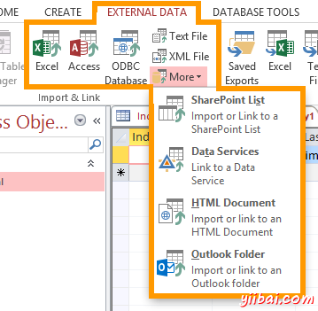

# Access添加数据 - Access教程

在Microsoft Access，有很多方法将数据添加到您的数据库。选择方法在很大程度上取决于有多少数据需要添加，以及数据是否已经存在接入之外的方法。

以下是将数据添加到数据库的主要方法的解释。

## 数据表视图

您可以直接输入到表中，而它在数据表视图。 虽然这是很好的一个小数量的很少更新小表记录，如果打算保持大量的记录这是不适合的。维护即使是很小的数据库可以成为一个非常耗时的任务，如果记录频繁改变 - 特别是如果你需要更新的分布在多个表中的数据。 它也没有真正合适是否会有非技术用户维护数据库。对于非技术用户，它是最好创建一个漂亮的用户友好的窗体。

## 表单

您可以设置表单，使非技术用户可以将数据输入到表格。一旦提交表单，数据被自动插入到数据库中。一个关于表单的大的事是，可以插入到许多表 - 不必打开每个表手动插入数据。

Access提供了一个表单向导，它会引导您完成整个过程，以建立一种表单。将在下一课中介绍。

## SQL视图

可以使用SQL视图将数据插入到你的数据库。也可以使用SQL视图做很多其他的事情使用数据库（包括创建表）。SQL（代表结构化查询语言）是标准的编程语言处理数据库。

要从功能区SQL视图中，选择CREATE &gt; Query Design，（关闭弹出表 - 所谓的显示表），然后选择SQL视图。

## 外部数据

有可能是时候，你需要使用已经存在的数据加载数据库。 例如，可能要转移到Access数据库到Excel电子表格数据，甚至.csv文件。这是可以做到的！

Access 2013允许您从以下文件类型中导入数据：

*   Microsoft Excel
*   Microsoft Access
*   ODBC Databases, such as SQL Server
*   Text or comma-separated value (CSV) files
*   ShareYiibai List
*   XML
*   Data Services
*   HTML Document
*   Outlook folder

为了从这些文件类型的导入数据，从功能区中选择外部数据，选择文件类型，然后按照提示进行操作：

也可以使用这个菜单链接到不同的文件类型（而不是导入）。这样可以提供从外部数据库或文件的最新数据。 此选项不进行根据文件类型有一些限制。Access 2013可以链接到以下文件类型：

*   Microsoft Excel (read-only)
*   Microsoft Access
*   ODBC Databases, such as SQL Server
*   Text or comma-separated value (CSV) files (add new records only)
*   ShareYiibai List
*   Data Services (read-only)
*   HTML Document
*   Outlook folder

