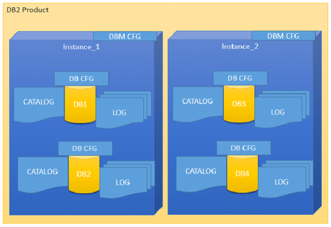

# DB2实例 - DB2教程

实例是DB2数据库管理器中的逻辑环境。使用实例可以管理数据库。根据我们的要求，可以在一台物理机器创建多个实例。实例目录的内容是：

*   数据库管理器配置文件
*   系统数据库目录
*   节点目录
*   节点配置文件 [db2nodes.cfg]
*   调试文件，转储文件

对于DB2数据库服务器，默认情况下是“DB2”。这不可以在创建后更改实例目录的位置。一个实例可以管理多个数据库。在一个实例，每个数据库都有一个唯一的名称，它自己的一套目录表，配置文件，权限和特权认证。

## DB2产品架构



## 多个实例

可以在Linux，UNIX和Windows的一个DB2Server，创建多个实例。它可以将一个物理机器上安装多个DB2Servers。

## 在Linux上创建实例

可以在Linux和UNIX创建多个实例，如果DB2服务器安装为root用户。一个实例可以同时在Linux和UNIX独立运行。可以在一次在数据库管理器的单个实例中工作。

实例文件夹中包含数据库配置文件和文件夹。实例目录存储在取决于Windows操作系统版本的不同位置。

## 实例列表

下面的命令用于列出的实例：

### db2ilist

该命令列出了所有可用的系统上的实例。

语法:

```
db2ilist 

```

**示例:** [看看由DB2副本创建有多少实例]

```
db2ilist 

```

**输出：** 
```
db2inst1 
db2inst2 
db2inst3  

```

## 实例环境的命令

这些命令符合实例在DB2 CLI管理工作有用。

### 获得实例

此命令显示当前运行的实例的详细信息。

**语法:**

```
db2 get instance 

```

**示例: **[看看当前实例由哪个当前用户的激活]

```
db2 get instance 

```

输出：

```
The current database manager instance is : db2inst1 

```

### 设置实例

要启动或停止DB2 UDB实例的数据库管理器，下面的命令执行当前实例。

**语法:**

```
set db2instance=<instance_name> 

```

**示例:** [ 安排“db2inst1”环境到当前用户]

```
set db2instance=db2inst1

```

### db2start

使用此命令，就可以启动一个实例。在此之前，需要运行“set instance”。

语法:

```
db2start 

```

示例: [要启动一个实例]

```
db2start

```

输出:

```
SQL1063N DB2START processing was successful

```

### db2stop

使用此命令可以停止正在运行的实例。

语法:

```
db2stop 

```

输出：

```
SQL1064N DB2STOP processing was successful.

```

## 创建一个实例

让我们来看看如何创建一个新的实例。

### db2icrt

如果想创建一个新的实例，需要使用root身份登录。实例ID不可以是root id或root名称。

下面是步骤来创建一个新的实例：

**步骤1:** 创建例如操作系统用户。

**语法:**

```
useradd -u <ID> -g <group name> -m -d <user location> <user name> 
-p <password>  

```

**示例:**  [在组“db2iadm1”和密码“db2inst2”创建实例名为'db2inst2'用户]

```
useradd -u 1000 -g db2iadm1 -m -d /home/db2inst2 db2inst2 -p db2inst2   
```

**步骤2: **转到root用户DB2实例目录中创建新实例。

位置:

```
cd /opt/ibm/db2/v10.1/instance   
```

**步骤3:** 使用下面的语法创建实例：

语法:

```
./db2icrt -s ese -u <inst id> <instance name>

```

**示例:** [创建一个新的实例”db2inst2“在用户db2inst2“带有”ESE“（企业服务器版）功能，]

```
./db2icrt -s ese -u db2inst2 db2inst2

```

输出:

```
DBI1446I The db2icrt command is running, please wait.
 ….
 ….. 
DBI1070I Program db2icrt completed successfully.

```

## 配置通信端口和主机的一个实例

编辑/etc/services文件，并添加端口号。在下面给出的语法，'inst_name'表示的实例名，'inst_port' 表指实例的端口号。

语法:

```
db2c_<inst name> <inst_port>/tcp

```

例如：[添加'50001/tcp“端口号，例如”db2inst2“与”services“文件变量”db2c_db2inst2']

```
db2c_db2inst2 50001/tcp

```

**语法 1**: [更新数据库管理器配置与服务名称。以下语法'svcename'表示实例服务名称，以及“inst_name”表示实例名称]

```
db2 update database manager configuration using svcename db2c_&<inst_name>

```

**示例:** [更新DBM配置变量svcename的值为“db2c_db2inst2”，为实例“db2inst2”

```
db2 update database manager configuration using svcename db2c_db2inst2 

```

**输出**

```
DB20000I The UPDATE DATABASE MANAGER CONFIGURATION command completed successfully.

```

**语法2：**设置“tcpip”通讯协议为当前实例

```
db2set DB2COMM=tcpip 

```

**语法3：**停止和启动当前实例得到来自数据库管理器配置更新的值]

```
db2stop 
db2start 

```

## 更新实例

可以使用以下命令更新实例：

### db2iupdt

此命令用于同一版本释放内更新实例。执行此命令之前，需要使用“db2stop”命令停止实例数据库管理器。下面的“inst_name”语法表示前释放或安装DB2服务器实例的名称，要升级到新的版本或安装DB2服务器版本。

**语法1:** 更新正常模式下的一个实例

```
db2iupdt <inst_name> 

```

**实例1:**

```
./db2iupdt db2inst2 

```

语法 2: 更新调试模式实例

```
db2iupdt -D <inst_name> 

```

实例

```
db2iupdt -D db2inst2  

```

## 升级实例

可以从先前版本的DB2副本的实例升级到目前新安装的DB2副本版本。

### db2iupgrade

在Linux或UNIX系统中，该命令位于DB2DIR/ instance目录。在下面的语法，“inst_name”表示以前的版本DB2实例和“inst_username”表示当前安装的版本DB2副本实例用户。

**语法 2：**

```
db2iupgrade -d -k -u <inst_username> <inst_name>  

```

示例：

```
db2iupgrade -d -k -u db2inst2 db2inst2 

```

命令参数：

**-d :** 打开调试模式。

**-k :** 保持如果支持的DB2副本，从正在运行此命令升级前的实例类型。

如果使用的是超级用户（SU）在Linux上的db2iupgrade命令，必须发出“su”命令以及“- ”选项。

## 删除实例

可以删除或删除实例，这是由“db2icrt”命令创建的。

### db2idrop

在Linux和UNIX操作系统，此命令位于DB2_installation_folder/实例目录。

**语法：**[ 以下语法，“inst_username”表示实例的用户名,“inst_name”表示实例名称]

```
db2idrop -u <inst_username> <inst_name> 

```

例如：[删除db2inst2]

```
./db2idrop -u db2inst2 db2inst2  

```

## 使用实例与其他命令

命令找出我们当前工作的DB2实例。

**语法1：**检查由数据库管理器激活当前实例]

```
db2 get instance  

```

**输出：**

```
The current database manager instance is:  db2inst1  

```

**语法2：**要查看当前实例与操作位和发行版本]

```
db2pd -inst | head -2  

```

示例

```
db2pd -inst | head -2  

```

输出

```
Instance db2inst1 uses 64 bits and DB2 code release SQL10010   

```

语法3：要检查当前的工作实例的名称]

```
db2 select inst_name from sysibmadm.env_inst_info    

```

实例:

```
db2 select inst_name from sysibmadm.env_inst_info    

```

输出：

```
INST_NAME  --------------------------------------  
db2inst1              
1 record(s) selected.  

```

**语法:** [设置为默认的新实例]

```
db2set db2instdef=<inst_name> -g   

```

**例如：**[数组新创建的实例作为默认实例]

```
db2set db2instdef=db2inst2 -g   
```

