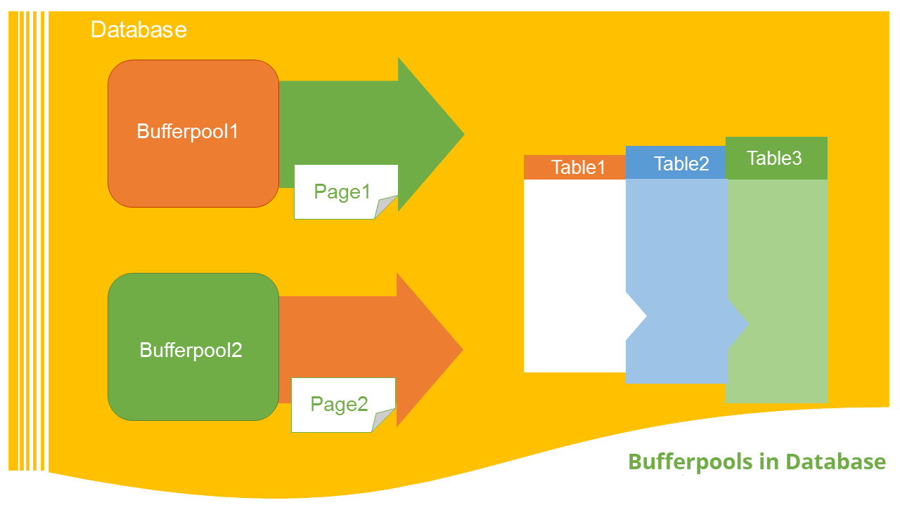

# DB2缓冲池 - DB2教程

本章介绍数据库缓冲池。



## 介绍

缓冲池是由数据库管理分配一个主存空间部分。缓冲池的目的是从磁盘高速缓存表和索引数据。所有数据库都有自己的缓冲池。默认缓冲池是在创建新数据库时创建的。它被称为“IBMDEFAULTBP”。根据用户的要求，有可能创造一些缓冲池。在缓冲池，数据库管理器放置表行的数据作为页。当前页停留在缓冲直到数据库是关闭或直到空间被写入新的数据。在缓冲的页面，这是更新的数据，但不写入到磁盘，被称为“脏”的页面。后在缓冲更新的数据页写入磁盘上，缓冲池是准备采取另一个数据。

## 表空间和缓冲池之间的关系

每个表空间与数据库中的一个特定的缓冲池相关联。一个表空间与一个缓冲池相关联。缓冲池和表空间的大小必须一致。多个缓冲池允许配置使用的数据库，以提高其整体性能的内存。

## 缓冲池大小

缓冲池页面的大小，当使用“CREATE DATABASE”命令设置。如果不指定页面大小，将采取默认的页面大小，这是4KB。一旦缓冲被建立，因此不可能以后修改页大小

## 在当前数据库目录列出了可用的缓冲池

语法：[下面的语法显示所有可用的缓冲池在数据库]

```
db2 select * from syscat.bufferpools   

```

例如：[要查看当前数据库中可用的缓冲池]

```
db2 select * from syscat.bufferpools  

```

输出

```
BPNAME      BUFFERPOOLID DBPGNAME   NPAGES      PAGESIZE    ESTORE 
NUMBLOCKPAGES BLOCKSIZE   NGNAME
------------------------------------------------------------ 
IBMDEFAULTBP                                                                                                                
 1 -                                                                                                  
 -2        4096 N                  0           0 -     

 1 record(s) selected.   

```

## 创建缓冲池

要创建数据库服务器新的缓冲池，则需要两个参数，即“缓冲池名”和“页面大小”。下面的查询执行创建一个新的缓冲池。

语法：在下面的语法中，“bp_name”表示缓冲池的名字，'size'表示页面大小，需要声明的缓冲池（4K，8K，16K，32K）

```
db2 create bufferpool <bp_name> pagesize <size> 

```

例如：要创建一个新的缓冲池名称为“bpnew”和大小“8192”（8KB）。]

```
db2 create bufferpool bpnew pagesize 8192  

```

输出

```
DB20000I The SQL command completed successfully.  

```

## 删除缓冲池

丢弃缓冲之前，需要检查是否有任何表被分配给它。

语法：[要删除的缓冲池]

```
drop bufferpool <bp_name>  

```

例如：要删除名为'bpnew“的缓冲池]

```
db2 drop bufferpool bpnew  

```

输出

```
DB20000I The SQL command completed successfully. 
```

