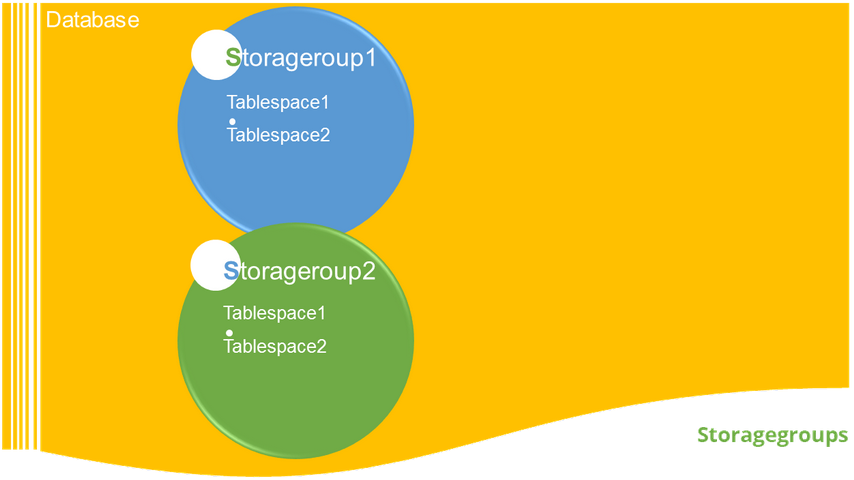

# DB2存储组 - DB2教程

本章将介绍数据库存储组：



## 介绍

一组存储路径用来存储数据库表或对象，是一个存储组。可以将表空间的存储组。当创建一个数据库，所有的表空间采取默认存储组。默认的存储组的数据库“IBMSTOGROUP”。当创建一个新的数据库，默认的存储组是活动的，如果通过“AUTOMATIC STOGROUP NO”参数在“CREATE DATABASE”命令的结束。该数据库不具有任何默认存储组。

## 存储组列表

可以列出数据库中的所有存储组。

语法：[要查看可用的存储组列表在当前数据库]

```
db2 select * from syscat.stogroups

```

例如：[查看可用的存储组列表在当前数据库]

```
db2 select * from syscat.stogroups

```

## 创建一个存储组

下面是在数据库中创建一个存储组的语法：

语法：[要创建一个新的存储组。“stogropu_name”表示新的存储组名字和“path”表示数据(表)的存储位置]

```
db2 create stogroup <stogroup_name style="box-sizing: border-box;">on ‘path’</stogroup_name> 
```

例如：[要创建一个新的存储组“stg1'在data1文件夹]

```
db2 create stogroup stg1 on ‘/data1’

```

输出

```
DB20000I The SQL command completed succesfully 

```

## 创建存储组表空间

这里显示如何创建存储组的表空间：

语法：[要使用存在的存储组中创建一个新的表空间]

```
db2 create tablespace <tablespace_name>  using stogroup <stogroup_name> 

```

例如：要创建一个名为“ts1”使用已有的存储组“stg1”新表空间]

```
db2 create tablespace ts1 using stogroup stg1 

```

输出

```
DB20000I The SQL command completed succesfully 

```

## 改变一个存储组

可以使用下面的语法改变一个存储组的位置：

语法：[从原来的位置移动存储组新的位置]

```
db2 alter stogroup <sg_name style="box-sizing: border-box;">add ‘location’, ‘location’</sg_name> 
```

例如：[要修改位置路径从旧位置到新位置的名为“sg1”的存储组]

```
db2 alter stogroup sg1 add ‘/path/data3’, ‘/path/data4’ 

```

## 存储组中删除文件夹路径

删除存储组的文件夹路径，可以通过使用alter命令存储组添加新的位置。

语法：[要删除的存储组位置旧路径]

```
db2 alter stogroup <sg_name style="box-sizing: border-box;">drop ‘/path’</sg_name> 
```

例如：[从“stg1”删除存储组位置]

```
db2 alter stogroup stg1 drop ‘/path/data1’  

```

## 重新调整表空间

重新调整创建存储组或表空间的一个新的文件夹，而事务数据库上进行，表空间已满的表空间是必需的。重新调整的更新与新的存储组数据库配置文件。

语法：[为了重新调整旧的存储组路径，新的存储组的表空间]

```
db2 alter tablspace <ts_name> rebalance   

```

例如：[重新调整]

```
db2 alter tablespace ts1 rebalance   

```

## 重命名存储组

语法：[修改现有的存储名称的名称]

```
db2 rename stogroup <old_stg_name> to <new_stg_name>   

```

例如：[从'sg1'以新名字“sgroup1”修改存储组的名称]

```
db2 rename stogroup sg1 to sgroup1   

```

## 删除存储组

**第1步：**在删除任何存储组，可以为表空间分配一些不同的存储组。

语法：[指定其他存储组表空间]

```
db2 alter tablspace <ts_name> using stogroup <another sto_group_name>    

```

例如：从一个旧存储组改为名为“sg2”表空间“ts1”的新存储组]

```
db2 alter tablespace ts1 using stogroup sg2   

```

**第1步：**

语法：[ 删除现有存储组 ]

```
db2 drop stogorup <stogroup_name>   

```

例如：[从数据库中删除存储组“stg1”]

```
db2 drop stogroup stg1  
```

