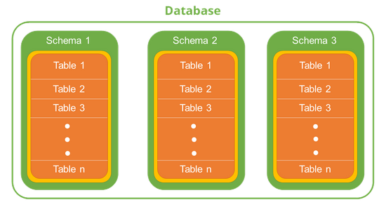

# DB2模式 - DB2教程

本章介绍和描述模式的概念。

## 介绍

模式是数据库中的逻辑分类命名对象的集合。

在数据库中，不能创建具有相同名称的多个数据库对象。要执行此操作，模式提供了一组环境。可以在数据库中创建多个模式，也可以创建多个同名的数据库对象，用不同的模式组。



模式可以包含表，函数，索引，表空间，过程，触发器等。例如，您可以创建命名为“Professional”和“Personal”为“employee”数据库中的两个不同的模式。它能够使两个不同的表具有相同名称的“employee”。在这种环境中，一个表具有专业的信息，而另一个具有雇员的个人信息。尽管有两个表具有相同的名称，他们有两个不同的模式“Personal”和“Professional”。因此，可以使用户不会遇到任何问题的工作。当有对表的命名约束，此功能非常有用。

让我们来看看相关模式的几个命令：

## 获得当前活动的模式

语法:

```
db2 get schema  
```

例如：[为了获得当前数据库架构]

```
db2 get schema   
```

## 以目前的环境设置另一个模式

语法：

```
db2 set schema=<schema_name>  
```

例如：[要整理'schema1“到当前实例环境]

```
db2 set schema=schema1 
```

## 创建新模式

语法：[要创建具有授权的用户ID的新模式]

```
db2 create schema <schema_name> authroization <inst_user> 
```

例如：要创建“schema1”模式使用授权“db2inst2”]

```
db2 create schema schema1 authorization db2inst2 
```

## 练习

让我们创建具有相同名称的两个不同的表，但它们分别在两种不同的模式。在这里，将创建员工表有两个不同的模式，一个用于个人及其他专业信息。

步骤1：创建两个模式。

模式1：[要创建一个模式名为professional]

```
db2 create schema professional authorization db2inst2 
```

**模式1：**[ 要创建一个模式名为personal ] 

```
db2 create schema personal authorization db2inst2
```

**第 2 步：**创建两个表具有相同名称的员工详细信息

**表1:  **professional.employee

[使用模式名“professional”在数据库中创建新表'employee']

```
db2 create table professional.employee(id number, name 
varchar(20), profession varchar(20), join_date date, 
salary number); 
```

**表2: ** personal.employee

[要在同一个数据库中的新表'employee'，使用模式名称'personal']

```
db2 create table personal.employee(id number, name 
varchar(20), d_birth date, phone bigint, address 
varchar(200));  
```

在执行这些步骤后，会得到两个表具有相同名称的“employee”，在两个不同的模式。

