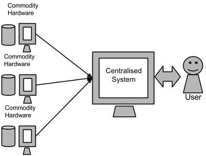
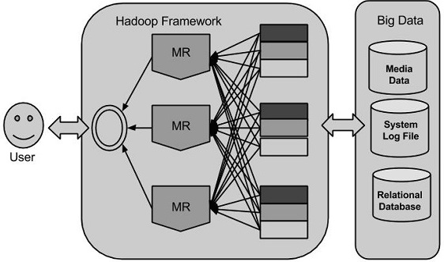

# Hadoop大数据解决方案 - Hadoop教程

## 传统的企业方法

在这种方法中，一个企业将有一个计算机存储和处理大数据。对于存储而言，程序员会自己选择的数据库厂商，如Oracle，IBM等的帮助下完成，用户交互使用应用程序进而获取并处理数据存储和分析。

### 局限性

这种方式能完美地处理那些可以由标准的数据库服务器来存储，或直至处理数据的处理器的限制少的大量数据应用程序。但是，当涉及到处理大量的可伸缩数据，这是一个繁忙的任务，只能通过单一的数据库瓶颈来处理这些数据。

## 谷歌的解决方案

使用一种称为MapReduce的算法谷歌解决了这个问题。这个算法将任务分成小份，并将它们分配到多台计算机，并且从这些机器收集结果并综合，形成了结果数据集。

## Hadoop

使用谷歌提供的解决方案，Doug Cutting和他的团队开发了一个开源项目叫做HADOOP。

Hadoop使用的MapReduce算法运行，其中数据在使用其他并行处理的应用程序。总之，Hadoop用于开发可以执行完整的统计分析大数据的应用程序。

