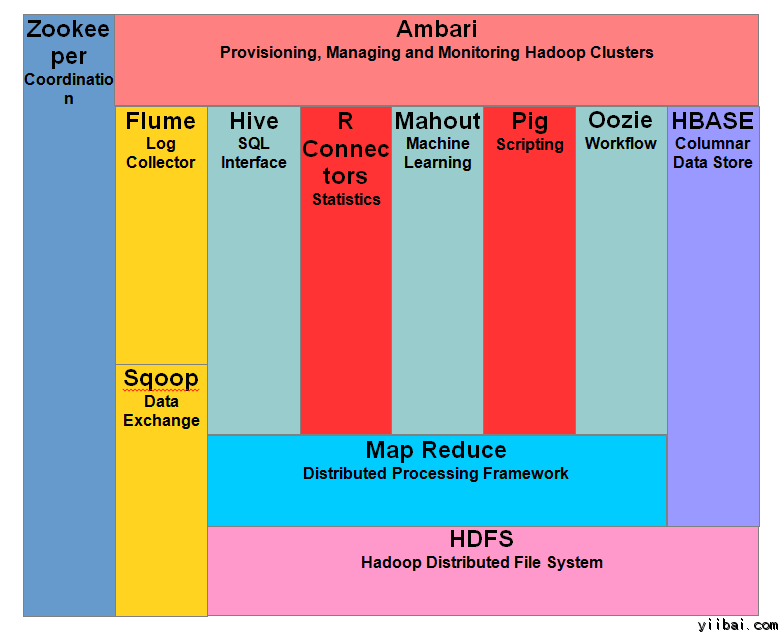
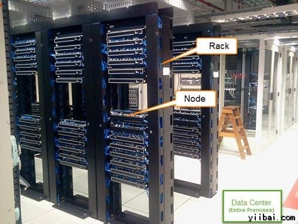

# Hadoop介绍快速入门 - Hadoop教程

Apache Hadoop 是用于开发在分布式计算环境中执行的数据处理应用程序的框架。类似于在个人计算机系统的本地文件系统的数据，在 Hadoop 数据保存在被称为作为Hadoop分布式文件系统的分布式文件系统。处理模型是基于“数据局部性”的概念，其中的计算逻辑被发送到包含数据的集群节点(服务器)。这个计算逻辑不过是写在编译的高级语言程序，例如 [Java](http://www.yiibai.com/java/ "Java"). 这样的程序来处理Hadoop 存储 的 HDFS 数据。

Hadoop是一个开源软件框架。使用Hadoop构建的应用程序都分布在集群计算机商业大型数据集上运行。商业电脑便宜并广泛使用。这些主要是在低成本计算上实现更大的计算能力非常有用。你造吗?  计算机集群由一组多个处理单元(存储磁盘+处理器)，其被连接到彼此，并作为一个单一的系统。

### Hadoop的组件

下图显示了 Hadoop 生态系统的各种组件

**Apache Hadoop 由两个子项目组成 -**

1.  Hadoop MapReduce : MapReduce 是一种计算模型及软件架构，编写在Hadoop上运行的应用程序。这些MapReduce程序能够对大型集群计算节点并行处理大量的数据。
2.  HDFS (Hadoop Distributed File System): HDFS 处理 Hadoop 应用程序的存储部分。 MapReduce应用使用来自HDFS的数据。 HDFS创建数据块的多个副本，并集群分发它们到计算节点。这种分配使得应用可靠和极其迅速的计算。

虽然 Hadoop 是因为 MapReduce 和分布式文件系统 - HDFS 而最出名的， 该术语也是在分布式计算和大规模数据处理的框架下的相关项目。 Apache Hadoop 的其他相关的项目包括有：Hive, HBase, Mahout, Sqoop , Flume 和 ZooKeeper.

### Hadoop 功能

**• 适用于大数据分析**

作为大数据在自然界中趋于分布和非结构化，Hadoop 集群最适合于大数据的分析。因为，它处理逻辑(未实际数据)流向计算节点，更少的网络带宽消耗。这个概念被称为数据区域性概念，它可以帮助提高基于 Hadoop 应用程序的效率。

**• 可扩展性**

HADOOP集群通过增加附加群集节点可以容易地扩展到任何程度，并允许大数据的增长。 另外，标度不要求修改到应用程序逻辑。

**• 容错**

HADOOP生态系统有一个规定，来复制输入数据到其他群集节点。这样一来，在集群某一节点有故障的情况下，数据处理仍然可以继续，通过使用存储另一个群集节点上的数据。

### 网络拓扑中的Hadoop

网络拓扑结构(布局)，当 Hadoop 集群的大小增长会影响到 Hadoop 集群的性能。除了性能，人们还需要关心故障的高可用性和处理。为了实现这个Hadoop集群构造，利用了网络拓扑。

通常情况下，网络带宽是任何网络要考虑的一个重要因素。然而，测量带宽可能是比较困难的，在 Hadoop 中，网络被表示为树，在 Hadoop 集群节点之间树(跳数)的距离是一个重要因素。在这里，两个节点之间的距离等于自己最近的公共祖先总距离。

Hadoop集群包括数据中心，机架和其实际执行作业的节点。这里，数据中心包括机架，机架是由节点组成。可用网络带宽进程的变化取决于进程的位置。 也就是说，可用带宽变得更小，因为 -

*   在同一个节点上的进程
*   同一机架上的不同节点
*   在相同的数据中心的不同的机架节点
*   在不同的数据中心节点
