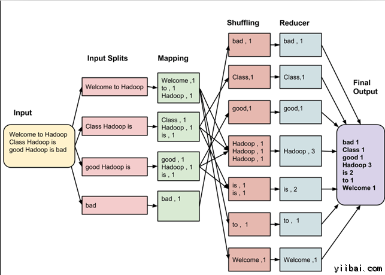

# MapReduce简介和入门 - Hadoop教程

MapReduce 是适合海量数据处理的编程模型。Hadoop是能够运行在使用各种语言编写的MapReduce程序： [Java](http://www.guru99.com/java-tutorial.html "Java"), Ruby, Python, and C++. MapReduce程序是平行性的，因此可使用多台机器集群执行大规模的数据分析非常有用的。

MapReduce程序的工作分两个阶段进行：

1.  **Map阶段** 2.  **Reduce 阶段**

输入到每一个阶段均是键 - 值对。此外，每一个程序员需要指定两个函数：map函数和reduce函数

整个过程要经历三个阶段执行，即

### MapReduce如何工作

让我们用一个例子来理解这一点 –

假设有以下的输入数据到 MapReduce 程序，统计以下数据中的单词数量：

Welcome to Hadoop Class

Hadoop is good

Hadoop is bad 

MapReduce 任务的最终输出是：

| bad  | 1 |
|:--- |:--- |
| Class  | 1 |
| good  | 1 |
| Hadoop  | 3 |
| is  | 2 |
| to  | 1 |
| Welcome  | 1 |

这些数据经过以下几个阶段

**输入拆分：**

输入到MapReduce工作被划分成固定大小的块叫做 input splits ，输入折分是由单个映射消费输入块。

**映射 - Mapping**

这是在 map-reduce 程序执行的第一个阶段。在这个阶段中的每个分割的数据被传递给映射函数来产生输出值。在我们的例子中，映射阶段的任务是计算输入分割出现每个单词的数量(更多详细信息有关输入分割在下面给出)并编制以某一形式列表&lt;单词，出现频率&gt;

**重排**

这个阶段消耗映射阶段的输出。它的任务是合并映射阶段输出的相关记录。在我们的例子，同样的词汇以及它们各自出现频率。

**Reducing**

在这一阶段，从重排阶段输出值汇总。这个阶段结合来自重排阶段值，并返回一个输出值。总之，这一阶段汇总了完整的数据集。

在我们的例子中，这个阶段汇总来自重排阶段的值，计算每个单词出现次数的总和。

### 详细的整个过程

*   映射的任务是为每个分割创建在分割每条记录执行映射的函数。
*   有多个分割是好处的， 因为处理一个分割使用的时间相比整个输入的处理的时间要少， 当分割比较小时，处理负载平衡是比较好的，因为我们正在并行地处理分割。
*   然而，也不希望分割的规模太小。当分割太小，管理分割和映射创建任务的超负荷开始逐步控制总的作业执行时间。
*   对于大多数作业，最好是分割成大小等于一个HDFS块的大小(这是64 MB，默认情况下)。
*   map任务执行结果到输出写入到本地磁盘的各个节点上，而不是HDFS。
*   之所以选择本地磁盘而不是HDFS是因为，避免复制其中发生 HDFS 存储操作。
*   映射输出是由减少任务处理以产生最终的输出中间输出。
*   一旦任务完成，映射输出可以扔掉了。所以，复制并将其存储在HDFS变得大材小用。
*   在节点故障的映射输出之前，由 reduce 任务消耗，Hadoop 重新运行另一个节点在映射上的任务，并重新创建的映射输出。
*   减少任务不会在数据局部性的概念上工作。每个map任务的输出被供给到 reduce 任务。映射输出被传输至计算机，其中 reduce 任务正在运行。
*   在此机器输出合并，然后传递到用户定义的 reduce 函数。
*   不像到映射输出，reduce输出存储在HDFS(第一个副本被存储在本地节点上，其他副本被存储于偏离机架的节点)。因此，写入 reduce 输出

### MapReduce如何组织工作？

Hadoop 划分工作为任务。有两种类型的任务：

1.  Map 任务 (分割及映射)
2.  Reduce 任务 (重排，还原)

如上所述

完整的执行流程(执行 Map 和 Reduce 任务)是由两种类型的实体的控制，称为

1.  Jobtracker : 就像一个主(负责提交的作业完全执行)
2.  多任务跟踪器 : 充当角色就像从机，它们每个执行工作

对于每一项工作提交执行在系统中，有一个 JobTracker 驻留在 Namenode 和 Datanode 驻留多个 TaskTracker。 

*   作业被分成多个任务，然后运行到集群中的多个数据节点。
*   JobTracker的责任是协调活动调度任务来在不同的数据节点上运行。
*   单个任务的执行，然后由 TaskTracker 处理，它位于执行工作的一部分，在每个数据节点上。
*   TaskTracker 的责任是发送进度报告到JobTracker。
*   此外，TaskTracker 周期性地发送“心跳”信号信息给 JobTracker 以便通知系统它的当前状态。
*   这样 JobTracker 就可以跟踪每项工作的总体进度。在任务失败的情况下，JobTracker 可以在不同的 TaskTracker 重新调度它。
