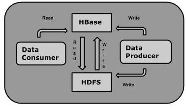
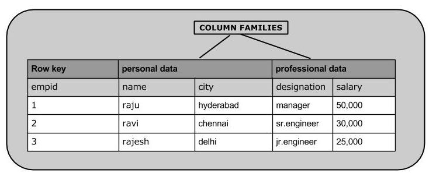

# HBase教程

自1970年以来，关系数据库用于数据存储和维护有关问题的解决方案。大数据的出现后，好多公司实现处理大数据并从中受益，并开始选择像 [Hadoop](http://www.yiibai.com/hadoop/) 的解决方案。

Hadoop使用分布式文件系统，用于存储大数据，并使用MapReduce来处理。Hadoop擅长于存储各种格式的庞大的数据，任意的格式甚至非结构化的处理。

### Hadoop的限制

Hadoop只能执行批量处理，并且只以顺序方式访问数据。这意味着必须搜索整个数据集，即使是最简单的搜索工作。

当处理结果在另一个庞大的数据集，也是按顺序处理一个巨大的数据集。在这一点上，一个新的解决方案，需要访问数据中的任何点（随机访问）单元。

### Hadoop随机存取数据库

应用程序，如HBase, Cassandra, couchDB, Dynamo 和 [MongoDB](http://www.yiibai.com/mongodb/) 都是一些存储大量数据和以随机方式访问数据的数据库。

## HBase是什么?

HBase是建立在Hadoop文件系统之上的分布式面向列的数据库。它是一个开源项目，是横向扩展的。

HBase是一个数据模型，类似于谷歌的大表设计，可以提供快速随机访问海量结构化数据。它利用了Hadoop的文件系统（HDFS）提供的容错能力。

它是Hadoop的生态系统，提供对数据的随机实时读/写访问，是Hadoop文件系统的一部分。

人们可以直接或通过HBase的存储HDFS数据。使用HBase在HDFS读取消费/随机访问数据。 HBase在Hadoop的文件系统之上，并提供了读写访问。

## HBase 和 HDFS

| HDFS | HBase |
| --- | --- |
| HDFS是适于存储大容量文件的分布式文件系统。 | HBase是建立在HDFS之上的数据库。 |
| HDFS不支持快速单独记录查找。 | HBase提供在较大的表快速查找 |
| 它提供了高延迟批量处理;没有批处理概念。 | 它提供了数十亿条记录低延迟访问单个行记录（随机存取）。 |
| 它提供的数据只能顺序访问。 | HBase内部使用哈希表和提供随机接入，并且其存储索引，可将在HDFS文件中的数据进行快速查找。 |

## HBase的存储机制

HBase是一个面向列的数据库，在表中它由行排序。表模式定义只能列族，也就是键值对。一个表有多个列族以及每一个列族可以有任意数量的列。后续列的值连续地存储在磁盘上。表中的每个单元格值都具有时间戳。总之，在一个HBase：

*   表是行的集合。
*   行是列族的集合。
*   列族是列的集合。
*   列是键值对的集合。

下面给出的表中是HBase模式的一个例子。

<table>
	<tbody>
		<tr>
			<th>Rowide</th>
			<th>Column Family</th>
			<th>Column Family</th>
			<th>Column Family</th>
			<th>Column Family</th>
		</tr>
		<tr>
			<th>&nbsp;</th>
			<th>col1</th>
			<th>col2</th>
			<th>col3</th>
			<th>col1</th>
			<th>col2</th>
			<th>col3</th>
			<th>col1</th>
			<th>col2</th>
			<th>col3</th>
			<th>col1</th>
			<th>col2</th>
			<th>col3</th>
		</tr>
		<tr>
			<td>1</td>
			<td>&nbsp;</td>
			<td>&nbsp;</td>
			<td>&nbsp;</td>
			<td>&nbsp;</td>
			<td>&nbsp;</td>
			<td>&nbsp;</td>
			<td>&nbsp;</td>
			<td>&nbsp;</td>
			<td>&nbsp;</td>
			<td>&nbsp;</td>
			<td>&nbsp;</td>
			<td>&nbsp;</td>
		</tr>
		<tr>
			<td>2</td>
			<td>&nbsp;</td>
			<td>&nbsp;</td>
			<td>&nbsp;</td>
			<td>&nbsp;</td>
			<td>&nbsp;</td>
			<td>&nbsp;</td>
			<td>&nbsp;</td>
			<td>&nbsp;</td>
			<td>&nbsp;</td>
			<td>&nbsp;</td>
			<td>&nbsp;</td>
			<td>&nbsp;</td>
		</tr>
		<tr>
			<td>3</td>
			<td>&nbsp;</td>
			<td>&nbsp;</td>
			<td>&nbsp;</td>
			<td>&nbsp;</td>
			<td>&nbsp;</td>
			<td>&nbsp;</td>
			<td>&nbsp;</td>
			<td>&nbsp;</td>
			<td>&nbsp;</td>
			<td>&nbsp;</td>
			<td>&nbsp;</td>
			<td>&nbsp;</td>
		</tr>
	</tbody>
</table>

## 面向列和面向行

面向列的数据库是存储数据表作为数据列的部分，而不是作为行数据。总之它们拥有列族。

| 行式数据库 | 列式数据库 |
| --- | --- |
| 它适用于联机事务处理（OLTP）。 | 它适用于在线分析处理（OLAP）。 |
| 这样的数据库被设计为小数目的行和列。 | 面向列的数据库设计的巨大表。 |

下图显示了列族在面向列的数据库：

## HBase 和 RDBMS

| HBase | RDBMS |
| --- | --- |
| HBase无模式，它不具有固定列模式的概念;仅定义列族。 | RDBMS有它的模式，描述表的整体结构的约束。 |
| 它专门创建为宽表。 HBase是横向扩展。 | 这些都是细而专为小表。很难形成规模。 |
| 没有任何事务存在于HBase。 | RDBMS是事务性的。 |
| 它反规范化的数据。 | 它具有规范化的数据。 |
| 它用于半结构以及结构化数据是非常好的。 | 用于结构化数据非常好。 |

## HBase的特点

*   HBase线性可扩展。
*   它具有自动故障支持。
*   它提供了一致的读取和写入。
*   它集成了Hadoop，作为源和目的地。
*   客户端方便的Java API。
*   它提供了跨集群数据复制。

## 在哪里可以使用HBase？

*   Apache HBase曾经是随机，实时的读/写访问大数据。
*   它承载在集群普通硬件的顶端是非常大的表。
*   Apache HBase是此前谷歌Bigtable模拟非关系型数据库。 Bigtable对谷歌文件系统操作，同样类似Apache HBase工作在Hadoop HDFS的顶部。

## HBase的应用

*   它是用来当有需要写重的应用程序。
*   HBase使用于当我们需要提供快速随机访问的数据。
*   很多公司，如Facebook，Twitter，雅虎，和Adobe内部都在使用HBase。

## HBase 历史

| 年份 | 事件 |
| --- | --- |
| Nov 2006 | 谷歌公布 BigTable 文件。 |
| Feb 2007 | 最初的HBase原型创建由 Hadoop 贡献。 |
| Oct 2007 | 随着Hadoop 0.15.0，第一个可用的HBase也发布了。 |
| Jan 2008 | HBase成为 Hadoop 的子项目。 |
| Oct 2008 | HBase 0.18.1 发布。 |
| Jan 2009 | HBase 0.19 发布。 |
| Sept 2009 | HBase 0.20.0 发布。 |
| May 2010 | HBase 成为 Apache 的顶级项目。 |
