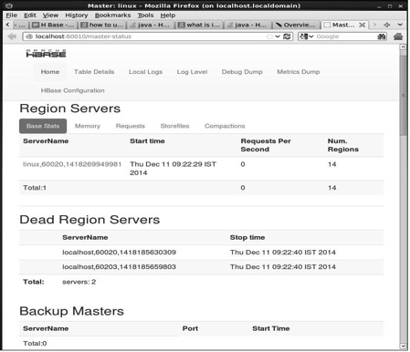

# HBase安装 - HBase教程

本章将介绍如何安装HBase和初始配置。 需要用Java和Hadoop来处理HBase，所以必须下载java和Hadoop并安装系统中。

## 安装前设置

安装Hadoop在Linux环境下之前，需要建立和使用Linux SSH(安全Shell)。按照下面设立Linux环境提供的步骤。

## 创建一个用户

首先，建议从Unix创建一个单独的Hadoop用户，文件系统隔离Hadoop文件系统。按照下面给出创建用户的步骤。

1.  开启root使用命令 “su”.
2.  使用root帐户命令创建用户 “useradd username”.
3.  现在，可以使用命令打开一个现有的用户帐户 “su username”.

打开Linux终端，输入以下命令来创建一个用户

```
$ su
password:
# useradd hadoop
# passwd hadoop
New passwd:
Retype new passwd

```

## SSH设置和密钥生成

SSH设置需要在集群上执行不同的操作，如启动，停止和分布式守护shell操作。进行身份验证不同的Hadoop用户，需要一种用于Hadoop的用户提供的公钥/私钥对，并用不同的用户共享。

以下的命令被用于生成使用SSH密钥值对。复制公钥从id_rsa.pub为authorized_keys，并提供所有者，读写权限到authorized_keys文件。

```
$ ssh-keygen -t rsa
$ cat ~/.ssh/id_rsa.pub >> ~/.ssh/authorized_keys
$ chmod 0600 ~/.ssh/authorized_keys

```

### 验证ssh

```
ssh localhost

```

## 安装Java

Java是Hadoop和HBase主要先决条件。首先应该使用"java -verion"检查java是否存在在您的系统上。 java -version 命令的语法如下。

```
$ java -version

```

如果一切正常，它会得到下面的输出。

```
java version "1.7.0_71"
Java(TM) SE Runtime Environment (build 1.7.0_71-b13)
Java HotSpot(TM) Client VM (build 25.0-b02, mixed mode)

```

如果Java还没有安装在系统中，然后按照下面给出的步骤安装Java。

### 步骤 1

下载Java（JDK - X64.tar.gz），可以通过访问以下链接 [http://www.oracle.com/technetwork/java/javase/downloads/jdk7-downloads-1880260.html](http://www.oracle.com/technetwork/java/javase/downloads/jdk7-downloads-1880260.html)。

jdk-7u71-linux-x64.tar.gz 将被下载到系统。

### 步骤 2

一般来说，下载文件夹中包含有Java文件。验证它，使用下面的命令提取jdk-7u71-linux-x64.gz文件。

```
$ cd Downloads/
$ ls
jdk-7u71-linux-x64.gz

$ tar zxf jdk-7u71-linux-x64.gz
$ ls
jdk1.7.0_71 jdk-7u71-linux-x64.gz

```

### 步骤 3

为了使Java提供给所有用户，必须将它移动到“/usr/local/”。打开终端然后以root用户身份键入以下命令。

```
$ su
password:
# mv jdk1.7.0_71 /usr/local/
# exit

```

### 步骤 4

有关设置PATH和JAVA_HOME变量，添加以下命令到〜/.bashrc文件。

```
export JAVA_HOME=/usr/local/jdk1.7.0_71
export PATH= $PATH:$JAVA_HOME/bin

```

现在从终端验证 java -version 命令如上述说明

## 下载Hadoop

安装Java之后，接下来就是安装Hadoop。首先使用“Hadoop version” 命令验证 Hadoop 是否存在，如下所示。

```
hadoop version

```

如果一切正常，它会得到下面的输出。

```
Hadoop 2.6.0
Compiled by jenkins on 2014-11-13T21:10Z
Compiled with protoc 2.5.0
From source with checksum 18e43357c8f927c0695f1e9522859d6a
This command was run using
/home/hadoop/hadoop/share/hadoop/common/hadoop-common-2.6.0.jar

```

如果系统上是无法找到 Hadoop，那么证明还未安装，现在下载Hadoop在您的系统上。按照下面给出的命令。

从Apache软件基金会下载并使用下面的命令提取 Hadoop-2.6.0。

```
$ su
password:
# cd /usr/local
# wget http://mirrors.advancedhosters.com/apache/hadoop/common/hadoop-
2.6.0/hadoop-2.6.0-src.tar.gz
# tar xzf hadoop-2.6.0-src.tar.gz
# mv hadoop-2.6.0/* hadoop/
# exit

```

## 安装 Hadoop

可在任何需要的方式安装Hadoop。在这里将展示 HBase 模拟分布式模式功能，因此模拟分布式模式的Hadoop安装。

按下面的步骤来安装 Hadoop 2.4.1.

### 第1步 - 设置Hadoop

可以通过附加下面的命令在 〜/ .bashrc文件中以设置 Hadoop 环境变量。

```
export HADOOP_HOME=/usr/local/hadoop
export HADOOP_MAPRED_HOME=$HADOOP_HOME
export HADOOP_COMMON_HOME=$HADOOP_HOME
export HADOOP_HDFS_HOME=$HADOOP_HOME
export YARN_HOME=$HADOOP_HOME
export HADOOP_COMMON_LIB_NATIVE_DIR=$HADOOP_HOME/lib/native
export PATH=$PATH:$HADOOP_HOME/sbin:$HADOOP_HOME/bin
export HADOOP_INSTALL=$HADOOP_HOME

```

现在，应用所有更改到当前正在运行的系统。

```
$ source ~/.bashrc 
```

### 第2步 - Hadoop配置

找到位于 “$HADOOP_HOME/etc/hadoop” 目录下所有的Hadoop配置文件。根据需要Hadoop将配置文件中的内容作修改。

```
$ cd $HADOOP_HOME/etc/hadoop

```

为了使用Java开发Hadoop程序，必须用java在系统中的位置来替换 hadoop-env.sh文件中的 java环境变量JAVA_HOME的值。

```
export JAVA_HOME=/usr/local/jdk1.7.0_71

```

编辑以下文件来配置Hadoop。

**core-site.xml** 
core-site.xml文件中包含，如：用于Hadoop实例的端口号，分配给文件系统，存储器限制用于存储数据存储器和读/写缓冲器的大小的信息。

打开core-site.xml，并在&lt;configuration&gt;和&lt;/configuration&gt;标签之间添加以下属性。

```
<configuration>
<property>
 <name>fs.default.name</name>
 <value>hdfs://localhost:9000</value>
 </property>
</configuration>

```

**hdfs-site.xml**

hdfs-site.xml文件中包含，如：复制数据的值，NameNode的路径，本地文件系统，要存储Hadoop基础架构的Datanode路径的信息。

假设有以下数据。

```
dfs.replication (data replication value) = 1
(In the below given path /hadoop/ is the user name.
hadoopinfra/hdfs/namenode is the directory created by hdfs file system.)
namenode path = //home/hadoop/hadoopinfra/hdfs/namenode
(hadoopinfra/hdfs/datanode is the directory created by hdfs file
system.)
datanode path = //home/hadoop/hadoopinfra/hdfs/datanode

```

打开这个文件，并在&lt;configuration&gt;和&lt;/configuration&gt; 标记之间添加以下属性。

```
<configuration$gt;
<property$gt;
 <name$gt;dfs.replication</name $gt;
 <value$gt;1</value$gt;
 </property$gt;
 <property$gt;
 <name$gt;dfs.name.dir</name$gt;
 <value$gt;file:///home/hadoop/hadoopinfra/hdfs/namenode</value$gt;
 </property$gt;
 <property$gt;
 <name$gt;dfs.data.dir</name$gt;
 <value$gt;file:///home/hadoop/hadoopinfra/hdfs/datanode</value$gt;
 </property$gt;
</configuration$gt;

```

注：上面的文件，所有的属性值是用户定义的，可以根据自己的Hadoop的基础架构进行更改。

**yarn-site.xml**

此文件用于配置成yarn在Hadoop中。打开yarn-site.xml文件，并在&lt;configuration&gt;&lt;configuration&gt;标签之前添加以下属性到这个文件中。

```
<configuration$gt;
<property$gt;
 <name$gt;yarn.nodemanager.aux-services</name$gt;
 <value$gt;mapreduce_shuffle</value$gt;
 </property$gt;
</configuration$gt;

```

**mapred-site.xml**

此文件用于指定MapReduce框架以使用。默认情况下Hadoop包含yarn-site.xml模板。首先，它需要从mapred-site.xml复制模板到mapred-site.xml文件，使用下面的命令来。

```
$ cp mapred-site.xml.template mapred-site.xml

```

打开 mapred-site.xml 文件，并在&lt;configuration&gt; 和 &lt;/configuration&gt;标签之间添加以下属性。

```
<configuration>
<property>
 <name>mapreduce.framework.name</name>
 <value>yarn</value>
 </property>
</configuration>

```

## 验证Hadoop安装

下面的步骤是用来验证Hadoop的安装。

### 第1步 - 名称节点设置

设置名称节点使用“hdfs namenode -format”命令如下

```
$ cd ~
$ hdfs namenode -format

```

预期的结果如下。

```
10/24/14 21:30:55 INFO namenode.NameNode: STARTUP_MSG:
/************************************************************
STARTUP_MSG: Starting NameNode
STARTUP_MSG: host = localhost/192.168.1.11
STARTUP_MSG: args = [-format]
STARTUP_MSG: version = 2.4.1
...
...
10/24/14 21:30:56 INFO common.Storage: Storage directory
/home/hadoop/hadoopinfra/hdfs/namenode has been successfully formatted.
10/24/14 21:30:56 INFO namenode.NNStorageRetentionManager: Going to
retain 1 images with txid >= 0
10/24/14 21:30:56 INFO util.ExitUtil: Exiting with status 0
10/24/14 21:30:56 INFO namenode.NameNode: SHUTDOWN_MSG:
/************************************************************
SHUTDOWN_MSG: Shutting down NameNode at localhost/192.168.1.11
************************************************************/ 
```

### 第2步 - 验证Hadoop DFS

下面的命令用来启动DFS。执行这个命令将启动Hadoop文件系统。

```
$ start-dfs.sh

```

预期的结果如下。

```
10/24/14 21:37:56
Starting namenodes on [localhost]
localhost: starting namenode, logging to /home/hadoop/hadoop-
2.4.1/logs/hadoop-hadoop-namenode-localhost.out
localhost: starting datanode, logging to /home/hadoop/hadoop-
2.4.1/logs/hadoop-hadoop-datanode-localhost.out
Starting secondary namenodes [0.0.0.0]

```

### 第3步  - 验证Yarn脚本

下面的命令用来启动yarn脚本。执行此命令将启动yarn守护进程。

```
$ start-yarn.sh

```

预期的结果如下。

```
starting yarn daemons
starting resourcemanager, logging to /home/hadoop/hadoop-
2.4.1/logs/yarn-hadoop-resourcemanager-localhost.out
localhost: starting nodemanager, logging to /home/hadoop/hadoop-
2.4.1/logs/yarn-hadoop-nodemanager-localhost.out 
```

### 第4步 - 访问Hadoop上的浏览器

访问Hadoop的默认端口号为50070。使用以下网址，以获取Hadoop服务在浏览器中。

```
http://localhost:50070

```


### 第5步 - 验证集群中的所有应用程序

访问群集的所有应用程序的默认端口号为8088。使用以下URL访问该服务。

```
http://localhost:8088/

```


## HBase安装

单机模式，模拟分布式模式，以及全分布式模式：可以在任何的三种模式来安装HBase。

### 在单机模式下安装HBase

使用 “wget” 命令下载HBase，下载网址为：[http://www.interiordsgn.com/apache/hbase/stable/](http://www.interiordsgn.com/apache/hbase/stable/) ，选择最新的稳定版本，并使用 tar “zxvf” 命令将其解压缩。请参见下面的命令。

```
$cd usr/local/
$wget http://www.interior-dsgn.com/apache/hbase/stable/hbase-0.98.8-
hadoop2-bin.tar.gz
$tar -zxvf hbase-0.98.8-hadoop2-bin.tar.gz

```

切换到超级用户模式，将HBase文件复制到/usr/local，如下图所示。

```
$su
$password: enter your password here
mv hbase-0.99.1/* Hbase/

```

### 在单机模式下配置HBase

在继续HBase之前，需要编辑下列文件和配置HBase。

**hbase-env.sh**

为HBase设置Java目录，并从conf文件夹打开hbase-env.sh文件。编辑JAVA_HOME环境变量，改变路径到当前JAVA_HOME变量，如下图所示。

```
cd /usr/local/Hbase/conf
gedit hbase-env.sh

```

这将打开HBase的env.sh文件。现在使用当前值替换现有JAVA_HOME值，如下图所示。

```
export JAVA_HOME=/usr/lib/jvm/java-1.7.0

```

**hbase-site.xml**

这是HBase的主配置文件。通过在 **/usr/local/HBase** 打开HBase主文件夹，设置数据目录到合适的位置。在 **conf** 文件夹里面有几个文件，现在打开hbase-site.xml文件，如下图所示。

```
#cd /usr/local/HBase/
#cd conf
# gedit hbase-site.xml

```

在hbase-site.xml文件里面，找到 &lt;configuration&gt; 和 &lt;/configuration&gt; 标签。并在其中，设置属性键名为“hbase.rootdir”，如下图所示的HBase目录。

```
<configuration>
//Here you have to set the path where you want HBase to store its files.
<property>
<name>hbase.rootdir</name>
<value>file:/home/hadoop/HBase/HFiles</value>
</property>
//Here you have to set the path where you want HBase to store its built
in zookeeper files.
<property>
<name>hbase.zookeeper.property.dataDir</name>
<value>/home/hadoop/zookeeper</value>
</property>
</configuration>

```

到此 HBase 的安装配置已成功完成。可以通过使用 HBase 的 bin 文件夹中提供 start-hbase.sh 脚本启动 HBase。为此，打开HBase 主文件夹，然后运行 HBase 启动脚本，如下图所示。

```
$cd /usr/local/HBase/bin
$./start-hbase.sh

```

如果一切顺利，当运行HBase启动脚本，它会提示一条消息：HBase has started

```
starting master, logging to /usr/local/HBase/bin/../logs/hbase-tpmaster-localhost.localdomain.out

```

### 在模拟分布式模式安装HBase

现在，来看看如何安装HBase在模拟分布式模式。

#### CONFIGURING HBASE

继续进行HBase之前，在本地系统或远程系统上配置Hadoop HDFS并确保它们正在运行。如果它正在运行则先停止HBase。

hbase-site.xml

编辑hbase-site.xml文件中添加以下属性。

```
<property>
 <name>hbase.cluster.distributed</name>
 <value>true</value>
</property>

```

它会提到在HBase的哪种模式运行。 从本地文件系统相同的文件改变hbase.rootdir，HDFS实例地址使用hdfs://// URI 语法。在本地主机的端口8030上运行HDFS。

```
<property>
 <name>>hbase.rootdir</name>
 <value>hdfs://localhost:8030/hbase</value>
</property>

```

### 启动HBase

经过配置结束后，浏览到HBase的主文件夹，并使用以下命令启动HBase。

```
$cd /usr/local/HBase
$bin/start-hbase.sh

```

**注：**在启动 HBase 之前，请确保 Hadoop 运行。

### 检查在HDFS的HBase目录

HBase创建其目录在HDFS中。要查看创建的目录，浏览到Hadoop bin并键入以下命令

```
$ ./bin/hadoop fs -ls /hbase

```

如果一切顺利的话，它会给下面的输出。

```
Found 7 items
drwxr-xr-x - hbase users 0 2014-06-25 18:58 /hbase/.tmp
drwxr-xr-x - hbase users 0 2014-06-25 21:49 /hbase/WALs
drwxr-xr-x - hbase users 0 2014-06-25 18:48 /hbase/corrupt
drwxr-xr-x - hbase users 0 2014-06-25 18:58 /hbase/data
-rw-r--r-- 3 hbase users 42 2014-06-25 18:41 /hbase/hbase.id
-rw-r--r-- 3 hbase users 7 2014-06-25 18:41 /hbase/hbase.version
drwxr-xr-x - hbase users 0 2014-06-25 21:49 /hbase/oldWALs

```

## 启动和停止主服务器

使用“local-master-backup.sh”就可以启动多达10台服务器。打开HBase的master主文件夹，并执行以下命令来启动它。

```
$ ./bin/local-master-backup.sh 2 4

```

要中止备份主服务，需要它的进程ID，它被存储在一个文件名为“/tmp/hbase-USER-X-master.pid”中，可以使用下面的命令中止备份主服务。

```
$ cat /tmp/hbase-user-1-master.pid |xargs kill -9

```

## 启动和停止区域服务器

可以使用下面的命令来运行在单一系统中的多个区域的服务器。

```
$ .bin/local-regionservers.sh start 2 3

```

要停止区域服务器，可以使用下面的命令。

```
$ .bin/local-regionservers.sh stop 3

```

## 启动HBaseShell

下面给出的是启动HBase shell的步骤。打开终端，并登录为超级用户。

### 启动Hadoop文件系统

通过Hadoop主目录下的sbin目录文件夹浏览并启动Hadoop文件系统，如下所示。

```
$cd $HADOOP_HOME/sbin
$start-all.sh

```

### 启动HBase

通过HBase根目录下的bin文件夹浏览并启动HBase。

```
$cd /usr/local/HBase
$./bin/start-hbase.sh

```

### 启动HBase主服务器

这在相同目录。启动它，如下图所示：

```
$./bin/local-master-backup.sh start 2 (number signifies specific
server.) 

```

### 启动区域服务

启动区域服务器，如下所示。

```
$./bin/./local-regionservers.sh start 3

```

### 启动HBase Shell

可以使用以下命令启动HBase shell

```
$cd bin
$./hbase shell

```

这会给出HBase shell 的提示符，如下图所示。

```
2014-12-09 14:24:27,526 INFO [main] Configuration.deprecation:
hadoop.native.lib is deprecated. Instead, use io.native.lib.available
HBase Shell; enter 'help<RETURN>' for list of supported commands.
Type "exit<RETURN>" to leave the HBase Shell
Version 0.98.8-hadoop2, r6cfc8d064754251365e070a10a82eb169956d5fe, Fri
Nov 14 18:26:29 PST 2014

hbase(main):001:0>

```

## HBase的Web界面

要访问 HBase 的 Web界面，在浏览器中键入以下URL

```
http://localhost:60010

```

以下界面列出了当前正在运行的区域服务器，备份主服务以及HBase表。

### HBase区域服务器和备份主服务



### HBase 表


## 设置Java环境

也可以使用Java库交互HBase，但访问HBase使用Java API之前，需要设置类库的路径。

### 设置类路径

继续进行之前编程，在.bashrc文件中设置类路径到HBase库。打开.bashrc文件编辑，如下所示。

```
$ gedit ~/.bashrc

```

为HBase库设置类路径（HBase的lib文件夹），如下图所示。

```
export CLASSPATH=$CLASSPATH://home/hadoop/hbase/lib/*

```

这是为了防止“未找到类（class not found）”异常，同时使用Java API访问HBase。

