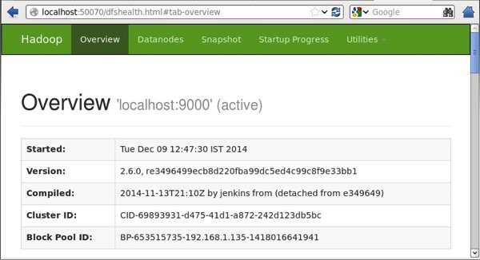

# Hive安装 - Hive教程

所有Hadoop的子项目，如Hive, Pig,和HBase 支持Linux的操作系统。因此，需要安装Linux OS。以下是为Hive的安装执行的简单步骤：

## 第1步：验证JAVA安装

在Hive安装之前，Java必须在系统上已经安装。使用下面的命令来验证是否已经安装Java：

```
$ java –version
```

如果Java已经安装在系统上，就可以看到如下回应：

```
java version "1.7.0_71" 
Java(TM) SE Runtime Environment (build 1.7.0_71-b13) 
Java HotSpot(TM) Client VM (build 25.0-b02, mixed mode)
```

如果Java尚未安装在系统中，那按照下面给出安装Java的步骤。

## 安装 Java

### 第(1)步：

下载Java（JDK&lt;最新版&gt; - X64.tar.gz）通过访问以下链接 [http://www.oracle.com/technetwork/java/javase/downloads/jdk7-downloads-1880260.html](http://www.oracle.com/technetwork/java/javase/downloads/jdk7-downloads-1880260.html)

那么JDK-7u71-linux-x64.tar.gz将被下载到系统中。

### 第(2)步：

一般来说，下载文件夹中下载的java文件。使用下面的命令提取jdk-7u71-linux-x64.gz文件。

```
$ cd Downloads/
$ ls
jdk-7u71-linux-x64.gz
$ tar zxf jdk-7u71-linux-x64.gz
$ ls
jdk1.7.0_71 jdk-7u71-linux-x64.gz
```

### 第(3)步：

为了使Java提供给所有用户，将它移动到/usr/local/。打开root用户，键入以下命令。

```
$ su
password:
# mv jdk1.7.0_71 /usr/local/
# exit
```

### 第（4）步：

设置PATH和JAVA_HOME变量，添加以下命令到〜/.bashrc文件。

```
export JAVA_HOME=/usr/local/jdk1.7.0_71
export PATH=PATH:$JAVA_HOME/bin
```

现在使用java-version命令从终端验证如上所述的安装。

## 第2步：验证Hadoop的安装

Hadoop必须在安装Hive之前安装。使用下面的命令来验证Hadoop的安装：

```
$ hadoop version
```

如果Hadoop已经安装在系统上，那么会得到以下回应：

```
Hadoop 2.4.1 Subversion https://svn.apache.org/repos/asf/hadoop/common -r 1529768 
Compiled by hortonmu on 2013-10-07T06:28Z 
Compiled with protoc 2.5.0 
From source with checksum 79e53ce7994d1628b240f09af91e1af4
```

如果在系统上还未安装Hadoop，然后继续进行下面的安装步骤：

## 下载Hadoop

从Apache软件基金会下载并使用下面的命令提取Hadoop2.4.1。

```
$ su
password:
# cd /usr/local
# wget http://apache.claz.org/hadoop/common/hadoop-2.4.1/
hadoop-2.4.1.tar.gz
# tar xzf hadoop-2.4.1.tar.gz
# mv hadoop-2.4.1/* to hadoop/
# exit
```

## 在伪分布式模式安装Hadoop

下列步骤用于在伪分布式模式下安装Hadoop2.4.1。

### 步骤I：设置Hadoop

可以通过附加下面的命令来设置Hadoop环境变量在〜/ .bashrc文件中。

```
export HADOOP_HOME=/usr/local/hadoop 
export HADOOP_MAPRED_HOME=$HADOOP_HOME 
export HADOOP_COMMON_HOME=$HADOOP_HOME 
export HADOOP_HDFS_HOME=$HADOOP_HOME 
export YARN_HOME=$HADOOP_HOME
export HADOOP_COMMON_LIB_NATIVE_DIR=$HADOOP_HOME/lib/native export
PATH=$PATH:$HADOOP_HOME/sbin:$HADOOP_HOME/bin
```

现在，应用所有更改到当前正在运行的系统。

```
$ source ~/.bashrc
```

### 步骤II：Hadoop配置

可以找到位置“$HADOOP_HOME/etc/hadoop”所有Hadoop配置文件。需要根据Hadoop基础架构作出适当的修改这些配置文件。

```
$ cd $HADOOP_HOME/etc/hadoop
```

为了使用java开发Hadoop的项目，必须用java在系统的位置替换JAVA_HOME值重置hadoop-env.sh文件中的java环境变量。

```
export JAVA_HOME=/usr/local/jdk1.7.0_71
```

下面给出的是编辑配置Hadoop的文件列表。

**core-site.xml**

core-site.xml文件中包含的信息，如使用Hadoop实例分配给文件系统的存储器，用于存储数据的内存限制的端口号，以及读/写缓冲器的大小。

打开core-site.xml文件并在&lt;configuration&gt;,&lt;/configuration&gt;标签之间添加以下属性。

```
<configuration>

   <property> 
      <name>fs.default.name</name> 
      <value>hdfs://localhost:9000</value> 
   </property>

</configuration>
```

**hdfs-site.xml**

hdfs-site.xml 文件中包含的信息，如复制数据的值，名称节点的路径，本地文件系统的数据节点的路径。

我们假定有以下数据。

```
dfs.replication (data replication value) = 1

(In the following path /hadoop/ is the user name.
hadoopinfra/hdfs/namenode is the directory created by hdfs file system.)

namenode path = //home/hadoop/hadoopinfra/hdfs/namenode

(hadoopinfra/hdfs/datanode is the directory created by hdfs file system.)
datanode path = //home/hadoop/hadoopinfra/hdfs/datanode
```

打开这个文件，并在此文件中的&lt;configuration&gt;&lt;/configuration&gt;标签之间添加以下属性。

```
<configuration>

   <property> 
      <name>dfs.replication</name> 
      <value>1</value> 
   </property> 
   <property> 
      <name>dfs.name.dir</name> 
      <value>file:///home/hadoop/hadoopinfra/hdfs/namenode </value> 
   </property> 
   <property> 
      <name>dfs.data.dir</name>
      <value>file:///home/hadoop/hadoopinfra/hdfs/datanode </value > 
   </property>

</configuration>
```

注：在上面的文件，所有的属性值是用户定义的，可以根据自己的Hadoop基础架构进行更改。

**yarn-site.xml**

此文件用于配置yarn到Hadoop。打开yarn-site.xml文件，并在此文件中的&lt;configuration&gt;&lt;/configuration&gt;标签之间添加以下属性。

```
<configuration>

   <property> 
      <name>yarn.nodemanager.aux-services</name> 
      <value>mapreduce_shuffle</value> 
   </property>

</configuration>
```

mapred-site.xml

此文件用于指定我们正在使用的MapReduce框架。缺省情况下，包含 yarn-site.xml模板。缺省情况下，包含yarn-site.xml模板。首先，需要将文件从mapred-site.xml复制。模板mapred-site.xml文件使用以下命令。

```
$ cp mapred-site.xml.template mapred-site.xml
```

打开mapred-site.xml文件，并在在此文件中的&lt;configuration&gt;&lt;/configuration&gt;标签之间添加以下属性。

```
<configuration>

   <property> 
      <name>mapreduce.framework.name</name> 
      <value>yarn</value> 
   </property>

</configuration>
```

## 验证Hadoop的安装

下面的步骤被用来验证Hadoop的安装。

### 步骤I：名称节点设置

使用命令“hdfs namenode -format”设置名称节点如下。

```
$ cd ~
$ hdfs namenode -format
```

预期的结果如下。

```
10/24/14 21:30:55 INFO namenode.NameNode: STARTUP_MSG: 
/************************************************************ 
STARTUP_MSG: Starting NameNode 
STARTUP_MSG: host = localhost/192.168.1.11 
STARTUP_MSG: args = [-format] 
STARTUP_MSG: version = 2.4.1 
... 
... 
10/24/14 21:30:56 INFO common.Storage: Storage directory 
/home/hadoop/hadoopinfra/hdfs/namenode has been successfully formatted. 
10/24/14 21:30:56 INFO namenode.NNStorageRetentionManager: Going to 
retain 1 images with txid >= 0 
10/24/14 21:30:56 INFO util.ExitUtil: Exiting with status 0
10/24/14 21:30:56 INFO namenode.NameNode: SHUTDOWN_MSG: 
/************************************************************ 
SHUTDOWN_MSG: Shutting down NameNode at localhost/192.168.1.11
 ************************************************************/
```

### 步骤 II: 验证Hadoop dfs

下面的命令用来启动dfs。执行这个命令将开始启动Hadoop文件系统。

```
$ start-dfs.sh
```

期望的输出如下所示：

```
10/24/14 21:37:56 
Starting namenodes on [localhost] 
localhost: starting namenode, logging to /home/hadoop/hadoop-2.4.1/logs/hadoop-hadoop-namenode-localhost.out 
localhost: starting datanode, logging to /home/hadoop/hadoop-2.4.1/logs/hadoop-hadoop-datanode-localhost.out 
Starting secondary namenodes [0.0.0.0]
```

### 步骤 III : 验证Yarn脚本

下面的命令用来启动yarn脚本。执行此命令将启动yarn守护进程。

```
$ start-yarn.sh
```

期望的输出如下所示：

```
starting yarn daemons 
starting resourcemanager, logging to /home/hadoop/hadoop-2.4.1/logs/yarn-hadoop-resourcemanager-localhost.out 
localhost: starting nodemanager, logging to /home/hadoop/hadoop-2.4.1/logs/yarn-hadoop-nodemanager-localhost.out
```

### 步骤 IV:在浏览器访问Hadoop

访问Hadoop的默认端口号为50070.使用以下网址，以获取浏览器Hadoop服务。

```
http://localhost:50070/
```



### 步骤  V: 验证集群的所有应用程序

访问集群中的所有应用程序的默认端口号为8088。使用以下URL访问该服务。

```
http://localhost:8088/
```


### 第3步：下载Hive

我们在本教程中使用hive-0.14.0。可以通过访问以下链接下载 [http://apache.petsads.us/hive/hive-0.14.0/.](http://apache.petsads.us/hive/hive-0.14.0/) 假设它下载到/Downloads目录。在这里，我们下载一个名为“apache-hive-0.14.0-bin.tar.gz”的Hive存档。下面的命令用来验证的下载：

```
$ cd Downloads
$ ls
```

下载成功完成，能看到以下回应：

```
apache-hive-0.14.0-bin.tar.gz
```

## 第4步：安装Hive

需要执行以下步骤在系统上安装配置单元。假设Hive存档下载到/Downloads目录。

### 提取和验证Hive存档

下面的命令来验证下载并解压hive存档：

```
$ tar zxvf apache-hive-0.14.0-bin.tar.gz
$ ls
```

下载成功完成，能看到以下回应：

```
apache-hive-0.14.0-bin apache-hive-0.14.0-bin.tar.gz
```

### 将文件复制到/usr/local/hive目录

我们需要将文件从超级用户“su -”复制。下面的命令用于从提取目录中的文件复制到"/usr/local/hive“目录。

```
$ su -
passwd:

# cd /home/user/Download
# mv apache-hive-0.14.0-bin /usr/local/hive
# exit
```

### 设置Hive环境

可以设置Hive环境，通过附加以下行到〜/.bashrc文件中：

```
export HIVE_HOME=/usr/local/hive
export PATH=$PATH:$HIVE_HOME/bin
export CLASSPATH=$CLASSPATH:/usr/local/Hadoop/lib/*:.
export CLASSPATH=$CLASSPATH:/usr/local/hive/lib/*:.
```

下面的命令是用来执行〜/.bashrc文件。

```
$ source ~/.bashrc
```

## 第5步：配置Hive

配置Hive用于Hadoop环境中，需要编辑hive-env.sh文件，该文件放置在 $HIVE_HOME/conf目录。下面的命令重定向到Hive config文件夹并复制模板文件：

```
$ cd $HIVE_HOME/conf
$ cp hive-env.sh.template hive-env.sh
```

通过编辑hive-env.sh文件添加以下行：

```
export HADOOP_HOME=/usr/local/hadoop
```

Hive安装成功完成。现在，需要一个外部数据库服务器配置Metastore。我们使用Apache Derby数据库。

## 第6步：下载并安装Apache Derby

按照下面的步骤来下载和安装Apache Derby：

### 下载 Apache Derby

下面的命令用于下载Apache Derby。它下载需要一定的时间。

```
$ cd ~
$ wget http://archive.apache.org/dist/db/derby/db-derby-10.4.2.0/db-derby-10.4.2.0-bin.tar.gz
```

下面的命令用来验证下载文件：

```
$ ls
```

下载成功完成，能看到以下回应：

```
db-derby-10.4.2.0-bin.tar.gz
```

### 提取和验证Derby存档

下面的命令用于提取和验证Derby存档：

```
$ tar zxvf db-derby-10.4.2.0-bin.tar.gz
$ ls
```

下载成功完成，能看到以下回应：

```
db-derby-10.4.2.0-bin db-derby-10.4.2.0-bin.tar.gz
```

### 将文件复制到/usr/local/derby 目录

我们需要超级用户“su- ”复制。下面的命令用于从提取目录中的文件复制到/usr/local/derby目录：

```
$ su -
passwd:
# cd /home/user
# mv db-derby-10.4.2.0-bin /usr/local/derby
# exit
```

### 设置Derby环境

可以通过附加以下行到〜/.bashrc文件设置Derby环境：

```
export DERBY_HOME=/usr/local/derby
export PATH=$PATH:$DERBY_HOME/bin
Apache Hive
18
export CLASSPATH=$CLASSPATH:$DERBY_HOME/lib/derby.jar:$DERBY_HOME/lib/derbytools.jar
```

下面的命令是用来执行〜/.bashrc文件：

```
$ source ~/.bashrc
```

### 创建一个目录来存放Metastore

创建一个名为data目录在$DERBY_HOME目录中，用于存储Metastore数据。

```
$ mkdir $DERBY_HOME/data
```

Derby安装和环境设置完成。

## 步骤7：配置Hive的Metastore

配置Metastore意味着，指定要Hive的数据库存储。可以通过编辑hive-site.xml 文件，在$HIVE_HOME/conf目录下可以做到这一点。首先，使用以下命令复制模板文件：

```
$ cd $HIVE_HOME/conf
$ cp hive-default.xml.template hive-site.xml
```

编辑hive-site.xml并在&lt;configuration&gt;和&lt;/configuration&gt;标记之间追加以下行：

```
<property>
   <name>javax.jdo.option.ConnectionURL</name>
   <value>jdbc:derby://localhost:1527/metastore_db;create=true </value>
   <description>JDBC connect string for a JDBC metastore </description>
</property>
```

创建一个文件名为 jpox.properties 并添加以下行：

```
javax.jdo.PersistenceManagerFactoryClass =

org.jpox.PersistenceManagerFactoryImpl
org.jpox.autoCreateSchema = false
org.jpox.validateTables = false
org.jpox.validateColumns = false
org.jpox.validateConstraints = false
org.jpox.storeManagerType = rdbms
org.jpox.autoCreateSchema = true
org.jpox.autoStartMechanismMode = checked
org.jpox.transactionIsolation = read_committed
javax.jdo.option.DetachAllOnCommit = true
javax.jdo.option.NontransactionalRead = true
javax.jdo.option.ConnectionDriverName = org.apache.derby.jdbc.ClientDriver
javax.jdo.option.ConnectionURL = jdbc:derby://hadoop1:1527/metastore_db;create = true
javax.jdo.option.ConnectionUserName = APP
javax.jdo.option.ConnectionPassword = mine
```

## 第8步：验证Hive安装

运行Hive之前，需要创建/tmp文件夹在HDFS独立的Hive文件夹。在这里使用/user/hive/warehouse文件夹。需要给这些新创建的文件夹写权限，如下图所示：

```
chmod g+w
```

现在，设置它们在HDFS验证Hive之前。使用下面的命令：

```
$ $HADOOP_HOME/bin/hadoop fs -mkdir /tmp 
$ $HADOOP_HOME/bin/hadoop fs -mkdir /user/hive/warehouse
$ $HADOOP_HOME/bin/hadoop fs -chmod g+w /tmp 
$ $HADOOP_HOME/bin/hadoop fs -chmod g+w /user/hive/warehouse
```

下面的命令来验证配置单元安装：

```
$ cd $HIVE_HOME
$ bin/hive
```

在成功安装Hive后，能看到以下回应：

```
Logging initialized using configuration in jar:file:/home/hadoop/hive-0.9.0/lib/hive-common-0.9.0.jar!/hive-log4j.properties 
Hive history file=/tmp/hadoop/hive_job_log_hadoop_201312121621_1494929084.txt
………………….
hive>
```

下面的示例命令以显示所有表：

```
hive> show tables; 
OK 
Time taken: 2.798 seconds 
hive>
```

