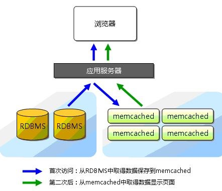

# Memcached 简介

Memcached是一个自由开源的，高性能，分布式内存对象缓存系统。

Memcached是以LiveJournal旗下Danga Interactive公司的Brad Fitzpatric为首开发的一款软件。现在已成为mixi、hatena、Facebook、Vox、LiveJournal等众多服务中提高Web应用扩展性的重要因素。

Memcached是一种基于内存的key-value存储，用来存储小块的任意数据（字符串、对象）。这些数据可以是数据库调用、API调用或者是页面渲染的结果。

Memcached简洁而强大。它的简洁设计便于快速开发，减轻开发难度，解决了大数据量缓存的很多问题。它的API兼容大部分流行的开发语言。

本质上，它是一个简洁的key-value存储系统。

一般的使用目的是，通过缓存数据库查询结果，减少数据库访问次数，以提高动态Web应用的速度、提高可扩展性。

Memcached 官网：[http://memcached.org/](http://memcached.org/)。

## 特征

memcached作为高速运行的分布式缓存服务器，具有以下的特点。

*   协议简单
*   基于libevent的事件处理
*   内置内存存储方式
*   memcached不互相通信的分布式

## 支持的语言

许多语言都实现了连接memcached的客户端，其中以Perl、PHP为主。仅仅memcached网站上列出的有：

*   Perl
*   PHP
*   Python
*   Ruby
*   C#
*   C/C++
*   Lua
*   等等

## Memcached 用户

*   LiveJournal
*   Wikipedia
*   Flickr
*   Bebo
*   Twitter
*   Typepad
*   Yellowbot
*   Youtube
*   WordPress.com
*   Craigslist
*   Mixi
