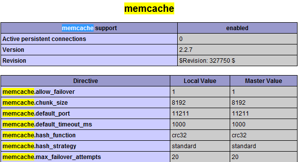

# PHP 连接 Memcached 服务

在前面章节中我们已经介绍了如何安装 Memcached 服务，接下来我们为大家介绍 PHP 如何使用 Memcached 服务。

### PHP Memcache 扩展安装

PHP Memcache 扩展包下载地址：[http://pecl.php.net/package/memcache](http://pecl.php.net/package/memcache)，你可以下载最新稳定包(stable)。

```
wget http://pecl.php.net/get/memcache-2.2.7.tgz               
tar -zxvf memcache-2.2.7.tgz
cd memcache-2.2.7
/usr/local/php/bin/phpize
./configure --with-php-config=/usr/local/php/bin/php-config
make && make install

```

**注意：**/usr/local/php/ 为php的安装路径，需要根据你安装的实际目录调整。

安装成功后会显示你的memcache.so扩展的位置，比如我的：

```
Installing shared extensions:     /usr/local/php/lib/php/extensions/no-debug-non-zts-20090626/

```

最后我们需要把这个扩展添加到php中，打开你的php.ini文件在最后添加以下内容：

```
[Memcache]
extension_dir = "/usr/local/php/lib/php/extensions/no-debug-non-zts-20090626/"
extension = memcache.so

```

添加完后 重新启动php,我使用的是nginx+php-fpm进程所以命令如下：

```
kill -USR2 `cat /usr/local/php/var/run/php-fpm.pid`

```

如果是apache的使用以下命令:

```
/usr/local/apache2/bin/apachectl restart

```

检查安装结果

```
/usr/local/php/bin/php -m | grep memcache

```

安装成功会输出：memcache。

或者通过浏览器访问 phpinfo() 函数来查看，如下图：



## PHP 连接 Memcached

```
<?php
$memcache = new Memcache;             //创建一个memcache对象
$memcache->connect('localhost', 11211) or die ("Could not connect"); //连接Memcached服务器
$memcache->set('key', 'test');        //设置一个变量到内存中，名称是key 值是test
$get_value = $memcache->get('key');   //从内存中取出key的值
echo $get_value;
?>

```

更多 PHP 操作 Memcached 请参阅： [http://php.net/manual/zh/book.memcache.php](http://php.net/manual/zh/book.memcache.php)
