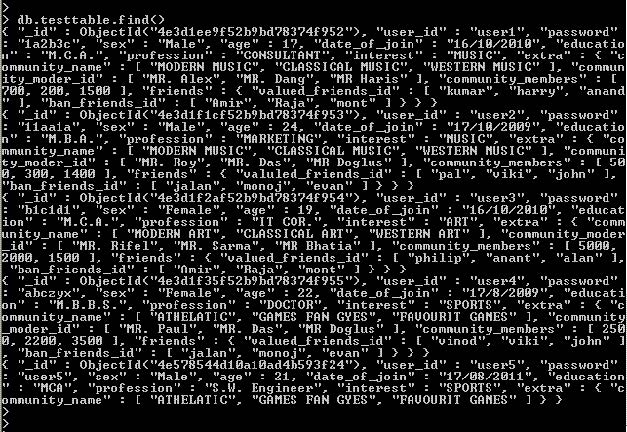

# MongoDB条件操作符 - $type

## 描述

在本章节中，我们将继续讨论MongoDB中条件操作符 $type。

$type操作符是基于BSON类型来检索集合中匹配的结果。

MongoDB中可以使用的类型：

| 类型描述 | 类型值 |
| --- | --- |
| Double | 1 |
| String | 2 |
| Object | 3 |
| Array | 4 |
| Binary data | 5 |
| Object id | 7 |
| Boolean | 8 |
| Date | 9 |
| Null | 10 |
| Regular expression | 11 |
| JavaScript code | 13 |
| Symbol | 14 |
| JavaScript code with scope | 15 |
| 32-bit integer | 16 |
| Timestamp | 17 |
| 64-bit integer | 18 |
| Min key | 255 |
| Max key | 127 |

**我们使用的数据库名称为"myinfo" 我们的集合名称为"testtable"，以下为我们插入的数据。**

简单的集合"testtable"：



## MongoDB 操作符 - $type 实例

如果想获取 "testtable" 集合包含在 "extra" 中的"friends"为BSON类型的对象，你可以使用以下命令：

```
> db.testtable.find({"extra.friends" : {$type : 3}})
```


## 更多实例

查询所有name字段是字符类型的数据：

```
db.users.find({name: {$type: 2}});
```

查询所有age字段是整型的数据：

```
db.users.find({age: {$type: 16}});
```


