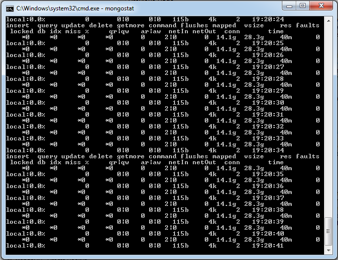
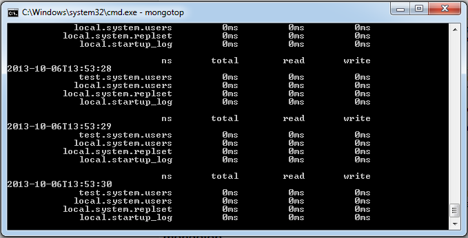
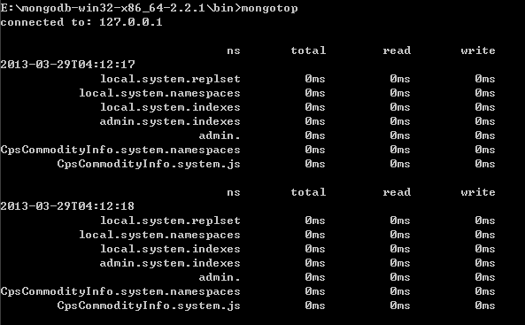
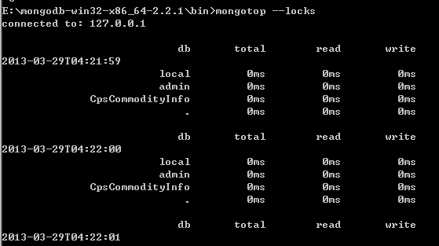

# MongoDB 监控

在你已经安装部署并允许MongoDB服务后，你必须要了解MongoDB的运行情况，并查看MongoDB的性能。这样在大流量得情况下可以很好的应对并保证MongoDB正常运作。

MongoDB中提供了mongostat 和 mongotop 两个命令来监控MongoDB的运行情况。

## mongostat 命令

mongostat是mongodb自带的状态检测工具，在命令行下使用。它会间隔固定时间获取mongodb的当前运行状态，并输出。如果你发现数据库突然变慢或者有其他问题的话，你第一手的操作就考虑采用mongostat来查看mongo的状态。

启动你的Mongod服务，进入到你安装的MongoDB目录下的bin目录， 然后输入mongostat命令，如下所示：

```
D:\set up\mongodb\bin>mongostat

```

以上命令输出结果如下：



## mongotop 命令

mongotop也是mongodb下的一个内置工具，mongotop提供了一个方法，用来跟踪一个MongoDB的实例，查看哪些大量的时间花费在读取和写入数据。 mongotop提供每个集合的水平的统计数据。默认情况下，mongotop返回值的每一秒。

启动你的Mongod服务，进入到你安装的MongoDB目录下的bin目录， 然后输入mongotop命令，如下所示：

```
D:\set up\mongodb\bin>mongotop

```

以上命令执行输出结果如下：



带参数实例

```
 E:\mongodb-win32-x86_64-2.2.1\bin>mongotop 10

```



后面的10是_&lt;sleeptime&gt;_参数 ，可以不使用，等待的时间长度，以秒为单位，mongotop等待调用之间。通过的默认mongotop返回数据的每一秒。

```
 E:\mongodb-win32-x86_64-2.2.1\bin>mongotop --locks

```

报告每个数据库的锁的使用中，使用mongotop - 锁，这将产生以下输出：



输出结果字段说明：

*   **ns：**

    包含数据库命名空间，后者结合了数据库名称和集合。

*   **db：**

    包含数据库的名称。名为 . 的数据库针对全局锁定，而非特定数据库。

*   **total：**

    mongod花费的时间工作在这个命名空间提供总额。

*   **read：**

    提供了大量的时间，这mongod花费在执行读操作，在此命名空间。

*   **write：**

    提供这个命名空间进行写操作，这mongod花了大量的时间。

