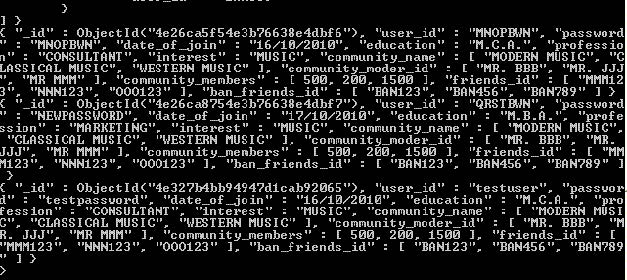

# MongoDB使用- remove()函数删除数据

## 描述

在前面的几个章节中我们已经学习了MongoDB中如何为集合添加数据和更新数据。在本章节中我们将继续学习MongoDB集合的删除。

MongoDB remove()函数是用来移除集合中的数据。

MongoDB数据更新可以使用update()函数。在执行remove()函数前先执行find()命令来判断执行的条件是否正确，这是一个比较好的习惯。

**我们使用的数据库名称为"myinfo" 我们的集合名称为"userdetails"，以下为我们插入的数据：**

```
> document=({"user_id" : "testuser","password" :"testpassword" ,"date_of_join" : "16/10/2010" ,"education"  
:"M.C.A." , "profession" : "CONSULTANT","interest" : "MUSIC","community_name" :["MODERN MUSIC", "CLASSICAL  
MUSIC","WESTERN MUSIC"],"community_moder_id" : ["MR. BBB","MR. JJJ","MR MMM"],"community_members" :  
[500,200,1500],"friends_id" : ["MMM123","NNN123","OOO123"],"ban_friends_id" :["BAN123","BAN456","BAN789"]});
```

```
> db.userdetails.insert(document)  
```

## 查看集合中已经插入的数据

```
> db.userdetails.find();
```



## 使用 remove() 函数移除数据

如果你想移除"userdetails"集合中"user_id" 为 "testuser"的数据你可以执行以下命令：

```
> db.userdetails.remove( { "user_id" : "testuser" } )  
```

## 删除所有数据

如果你想删除"userdetails"集合中的所有数据，可以执行以下命令：

```
> db.userdetails.remove({})  
```

## 使用drop()删除集合

如果你想删除整个"userdetails"集合，包含所有文档数据，可以执行以下数据：

```
> db.userdetails.drop()
```


drop()函数返回 true或者false。以上执行结果返回了true，说明操作成功。

## 使用dropDatabase()函数删除数据库

如果你想删除整个数据库的数据，你可以执行以下命令：

```
> db.dropDatabase()
```

执行命令前查看当前使用的数据库是一个良好的习惯，这样可以确保你要删除数据库是正确的，以免造成误操作而产生数据丢失的后果：


