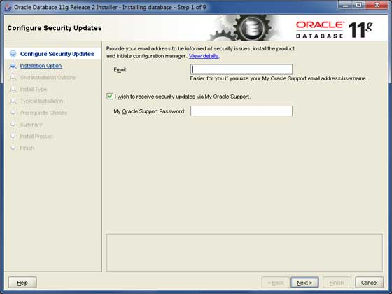
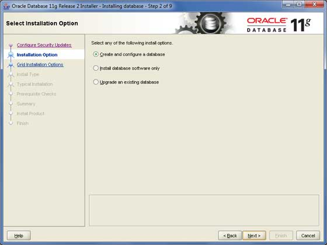
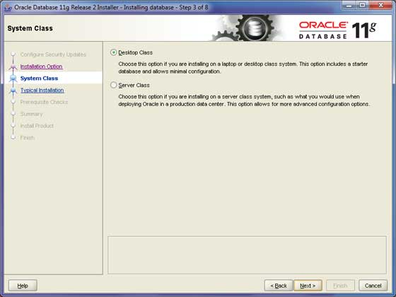
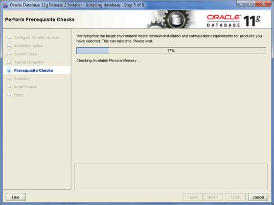
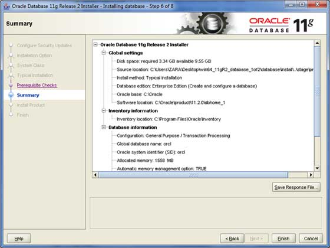
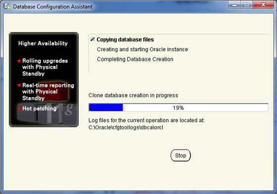
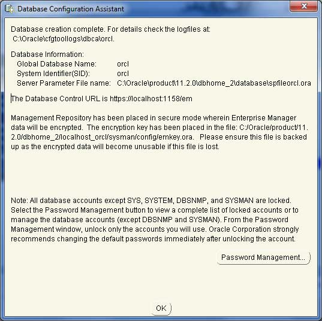
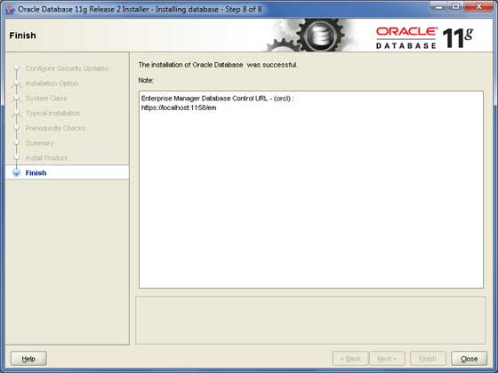
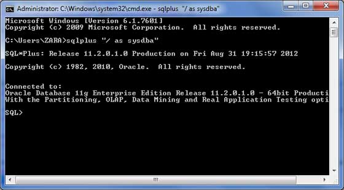

# PL/SQL环境安装设置 - PL/SQL教程

PL/SQL不是一个独立的编程语言;它是Oracle编程环境中的工具。 SQL* Plus是一个互动的工具，它可以在命令提示符下键入SQL和PL/SQL语句。这些命令被发送到数据库进行处理。语句被处理之后结果被发回，并在屏幕上显示出来。

要运行PL/SQL程序，应该在机器安装Oracle RBDMS服务器来执行SQL命令。最新版本的Oracle RDBMS是11g。可以从以下链接下载Oracle 11g试用版：

[Download Oracle 11g Express Edition](http://www.oracle.com/technetwork/database/enterprise-edition/downloads/index.html)

在学习PL/SQL之前，需要下载32位或64位版本的安装按你的操作系统。通常有两个文件，本示例中已经下载了对应64位到Windows7。在你的系统操作系统使用以下类似的步骤，如果是Linux或Solaris，那也不要紧。

*   win64_11gR2_database_1of2.zip

*   win64_11gR2_database_2of2.zip

下载上述两个文件后，需要解压缩它们到一个单独的目录 datebase ，并找到下面的子目录：


## 第1步

现在，让我们启动Oracle数据库使用安装程序安装文件。以下是第一个屏幕。可以提供电子邮件ID和取消选中，复选框并单击 **Next** 按钮：



## 第2步

在这一步中将有以下的屏幕，只需取消选中的复选框并单击 Continue 按钮继续。


## 第3步

只需选择第一个选项创建和使用单选按钮配置数据库(**Create and Configure Database**)，然后单击 **Next** 按钮继续：  



## 第4步

假设这里安装Oracle只是用于学习目的，那么只需在PC或笔记本电脑上安装它。所以选择桌面级选项，然后单击下一步(**Next**)按钮继续： 



## 第5步

提供一个位置来安装Oracle服务器。修改Oracle的安装路径和地点其余部分将自动设定。其次，必须提供一个密码用于系统的DBA。提供所需的信息，然后单击下一步(**Next**)按钮继续：


## 第5步

只需点击下一步（Next）按钮继续：



## 第7步

现在，单击Finish按钮继续，这将开始安装实际的服务器。



## 第8步

只是等待，直到的Oracle启动执行必要的配置。


## 第9步

在这里，Oracle安装将复制所需的配置文件，所以只是等待和观看：



## 第9步

一切都完成后，将显示以下对话框。只需单击OK按钮然后退出。



## 第11步

一旦安装完成后，将显示以下最后一个窗口。



## 最后一步

如果一切都已经成功完成，那么现在就来验证安装。如果使用的是Windows，使用以下命令：

```
sqlplus "/ as sysdba" 

```

如果一切正常，应该有SQL提示，那么可编写PL/SQL命令和脚本：



## 文本编辑器

从运行命令提示符大型程序可能导致在不经意间失去了一些工作。所以，更好的选择是使用命令文件。使用命令文件：

*   在文本编辑器中写入代码，如记事本，Notepad+，或EditPlus等等。

*   保存文件的扩展名为.sql在主目录。

*   启动SQL* Plus命令提示符从创建PL/SQL文件的目录。

*   输入@file_name在SQL* Plus命令提示符下执行程序。

如果使用的不是执行PL/SQL脚本文件，如果这样不能执行，那么只需复制PL/SQL代码，然后再用鼠标右键单击黑色窗口，SQL提示符并使用粘贴选项粘贴完整的代码在命令提示符下。最后，只需按Enter执行代码。

