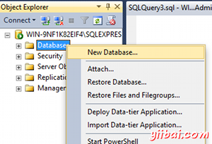
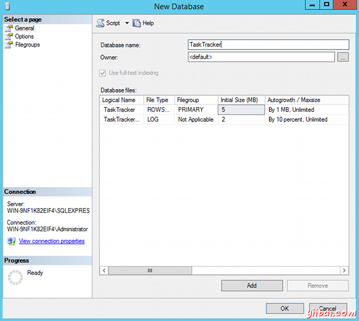
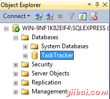
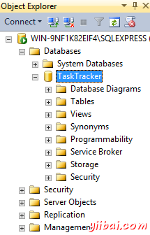
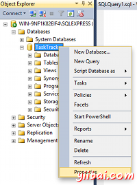
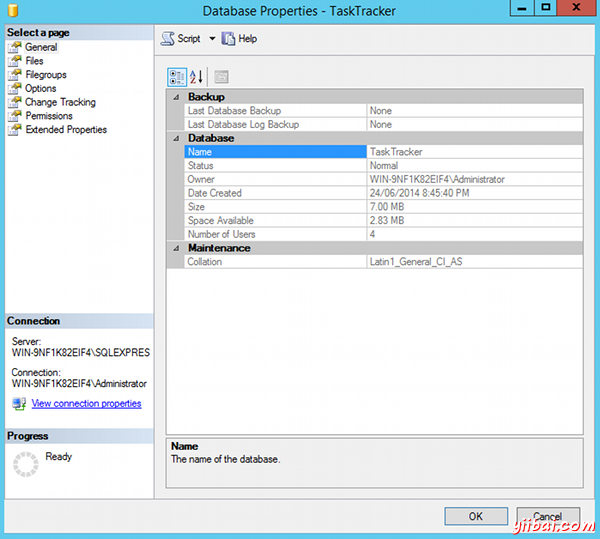

# SQL Server创建数据库 - SQL Server教程

现在，我们已经打开SQL Server管理套件，让我们开始创建一个数据库。

在本教程中我将创建一个数据库来跟踪任务. 它可以作为一个任务跟踪器应用程序的后端. 给定数据库的一个明显的名称，比如“TaskTracker”，好让知道它用意. 这将有助于区分其他数据库这个数据库 , 在我的SQL Server管理套件里有10或20个数据库(这将可能是有一些数据库管理员)。

创建数据库可以通过运行SQL脚本或以“点击，然后点击”完成。在这里，我们将使用“点击”。但首先，让我们来看看系统数据库。

## 系统数据库

当您安装SQL Server，以下四个数据库自动创建。

**master**  

此数据库存储系统级别的信息，如用户帐户，配置设置，并在所有其他数据库信息。  

**model**  

该数据库被用作所创建的所有其他数据库的模板。  

**msdb**  

msdb数据库是用于配置警报使用SQL Server代理和预定作业等  

**tempdb**  

这其中包含所有临时表，临时存储过程，并通过SQL Server生成任何其他临时存储需求。  

这些系统数据库和每个的存在是有特定的用途。当我们创建自己的数据库，该数据库将基于模型数据库（上图）上创建。该数据库为您创建的任何新数据库的模板。

## 如何创建一个新的数据库

下面的步骤演示了如何使用SQL Server管理套件在SQL Server 2014创建数据库。

1.  从对象资源管理器中，右键单击数据库文件夹/图标，然后选择 New database...: 
2.  命名你的数据库（这里叫TaskTracker），然后点击  OK: 
3.  没有更多的步骤......就大功告成了！

## 新数据库

新的数据库就会出现在对象资源管理器中（在系统数据库文件夹下）的数据库部分。这里是我的：

如所提到的，新的数据库是基于模型数据库。该模型数据库是被用作每当创建一个新的数据库模板的系统数据库。如果使用的左侧窗格中浏览到数据库，并展开树，你会发现，数据库已经包含了许多对象。例如，它已经包含的系统功能，系统视图，存储系统过程，和（隐藏）系统表。这些都是提供有关数据库的信息系统对象。

## 其他选项

我们刚刚创建使用默认选项的数据库。当创建的数据库，数据文件和一个事务日志中创建。他们为服务器的默认位置创建。

如果我们想想，我们可以指定一个不同的位置，这些文件在我们创建数据库的时候。我们也可以改变其它的规范，如是否允许将文件自动增长（如它存储越来越多的数据），如果是这样，增长应进行管理。

许多这些选项可以通过数据库属性，这可以通过在数据库和选择属性右击访问：

在属性对话框中包含了大量的更改数据库的配置选项。点击在左上面板的各个项目，将导致在被显示各自的选择。现在，我们将保留/使用一切的默认设置。

所以，我们刚刚创建的数据库。但它是一个空数据库。我们可以将数据添加到数据库之前，我们需要至少创建一个表。下一节我们来学习如何创建表；

