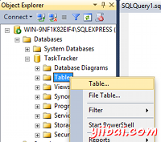
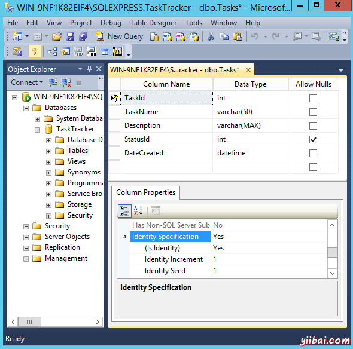
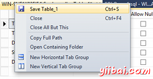
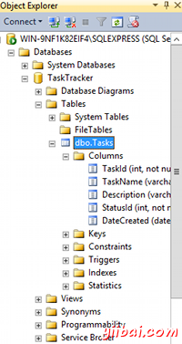

# SQL Server创建表 - SQL Server教程

上一节中我们创建了一个数据库。现在，让我们添加一个表。

作为我们的数据库是一个任务跟踪数据库，我们的第一个表叫做“Tasks”。 该表将持有的所有任务- 一个重要的属性状态。然后，我们可以创建另一个表名为“Status”。一旦我们的表包含数据，我们将能够运行针对这些表的查询，找出工作需要做什么和给定的状态，等等。

但是让我们不要超前。让我们来创建第一个表。

## 如何在SQL Server 2014创建表

这些步骤中使用SQL Server管理套件(SSMS)，在一个SQL Server 2014 数据库中创建一个表。

1.  确保有正确的数据库扩展(在我们的例子中，数据库为：TaskTracker)右键单击表图标并选择Table......从上下文菜单： 
2.  一个新表将在设计视图中打开。当你有这样的屏幕打开，请执行以下操作：
    1.  在截图中的值，完成细节的列名列数据类型列，允许空列。
    2.  通过右键单击旁边的TaskId按钮(即其中关键出现在下面的截图同一地区)，并选择设置主键TASKID列主键字段。
    3.  通过设置是一种身份为Yes(你可以找到在身份规格部分在底部窗格此选项)使TASKID列标识列。需要注意的是在底部窗格中设置的值，需要首先选择在顶部窗格中的列名。我们设置这个专栏是一个自动编号列 - 它会自动生成创建的每个记录一个新数值。
    4.  设置dateCreated列的缺省值为(getdate())。 (这将该字段为每个新记录自动插入当前日期到)。

    我们现在做的是创建的列名，指定可以输入数据类型，并设置默认值。限制每一列的数据类型是非常重要的，以帮助维护数据的完整性。例如，它可以防止我们意外输入任务名称到一个字段，用于存储当前日期。SQL Server将阻止进入表，数据不会粘附到我们已经为每列设置的规则的数据。

3.  保存该表通过选择 File &gt; Save Table_1 或者通过表的选项卡，然后从上下文菜单中选择保存Table_1上单击鼠标右键： 
4.  当系统提示，命名表（我们称之为Tasks）： 

## 新表

现在，您已经创建了一个新的表，它会出现在数据库表部分。如果不能看到它，请尝试刷新对象资源管理器。 您可以通过右键单击onTables并单击从上下文菜单刷新：

下面是表的截图与列文件夹扩展：

完成。现在，让我们[添加一些数据](http://www.yiibai.com/sql_server/adding_data.html)。

