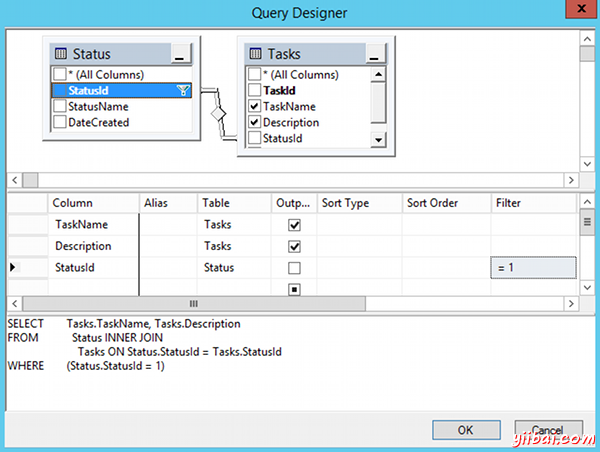

# SQL Server查询设计器 - SQL Server教程

在前面的课程，我们通过点击新建查询并运行一些SQL语句创建一个SQL脚本。在这一课中，我们将着眼于如何使用查询设计器编写SQL脚本 - 一个GUI构建的SQL语句。

## 关于查询设计器

查询设计器是协助建立查询SQL Server数据库的图形用户界面。构建复杂的查询时，涉及到许多表，视图等，这可能是特别有用

查询设计器还可以有利于学习如何编写SQL。通过查询设计器生成SQL，可以学习SQL，学习语法等。

## 建立查询

建立使用查询设计器的查询，请执行以下操作：

1.  在工具栏上单击新建查询(New Query)打开一个新的查询
2.  通过选择打开查询设计器 Query &gt; Design Query in Editor... 从顶部菜单： 
3.  选择要运行对查询（在本例中，我们将添加两个表），单击添加，单击关闭关闭对话框表： 
4.  选择列,想通过检查旁边的列名的复选框，在查询中显示。在中间窗格中，你可以取消一个输出复选框以隐藏该字段被显示在查询运行（但字段仍然会参与查询）。添加值下的过滤器来缩小结果到只有那些感兴趣的（在这个例子中，它是创建一个WHERE子句只选择那些记录了StatusId“1”- 也就是“To Do”）： 
5.  当满意查询后点击OK。
6.  该查询将出现在查询窗口，在这里可以运行它，运行任何其他查询相同的方式（点击！执行或按F5）

当点击OK，会发现查询已添加到工作空间。然后，可以运行它，就像任何其他查询一样。

查询 - 不要删除它。我们将使用查询来[创建SQL Server视图](http://www.yiibai.com/sql_server/sql_server_views.html)。

