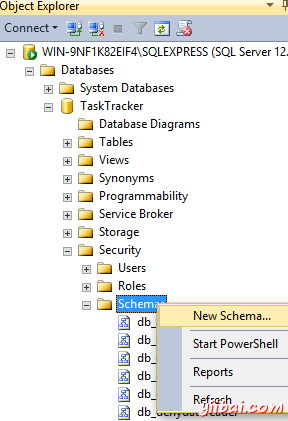
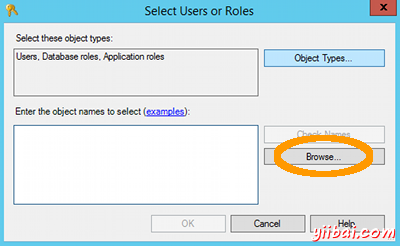
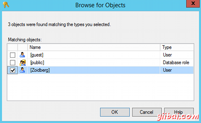
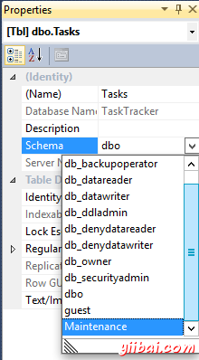

# SQL Server数据库模式 - SQL Server教程

在SQL Server中，数据库架构简化安全管理。模式有助于确定谁可以访问数据库对象。

数据库模式也可以作为一个命名空间。这可以防止来自不同模式的对象名称冲突。

## 什么是数据库模式？

数据库模式是一种逻辑分组对象，如表，视图，存储过程等。想想一个模式作为对象的容器。

可以指定一个用户登录权限的单一模式，以便用户只能访问他们被授权访问的对象。

模式可以创建和改变在数据库中，并且用户可以被允许访问的模式。 一个模式可以被任何用户所拥有，并且架构所有权转让。

## 创建数据库模式

要创建在SQL Server 2014数据库模式：

1.  从对象资源管理器，浏览到安全性和打开模式节点。
2.  右键单击架构并选择新建模式....就像这样： 
3.  完成常规选项卡的详细信息的新模式。在这个例子中，模式名称就是维护和架构所有者的db_owner(也可以使用搜索功能找到一个所有者)。 
4.  点击权限将用户添加到架构
5.  要添加用户，使用搜索...按钮，然后浏览...： 
6.  选择用户并单击OK： 
7.  当用户被添加，设置他们的权限。在我的例子，我授予Zoidberg用户更改，删除，插入，选择和更新权限： 
8.  通过扩展属性选项卡中添加任何扩展属性（我保留这个空白）
9.  点击OK.

## 添加一个表的新模式

现在我们有一个新的模式，我们可以添加对象，如表，视图和存储过程。例如，我们可以转移，我们在前面的教训，以新的模式中创建一个或多个表。

当我们创建了一个表（称为“Tasks”），它在默认数据库模式（“dbo”）建立。我们知道这是因为它出现在我们的对象浏览器为dbo.Tasks。

将“Tasks”表转移到“Maintenance”模式，做到以下几点：

1.  在对象资源管理器中，请确保正在使用的数据库TaskTracker，然后用鼠标右键单击任务表并选择设计： 
2.  从设计视图，属性窗口应该出现在右侧。如果没有，按F4键显示属性窗口。
3.  从属性窗口，更改架构到所需的模式： 
4.  可能会说称更改此对象的模式将导致目前所有的权限警告被丢弃。你确定要继续？点击OK继续。
5.  通过右键关闭设计视图点击选项卡上的x。
6.  当提示保存，单击"Ok"

你的表已经被转移到了“Maintenance”模式。

## 确认更改

确认更改：

1.  刷新通过右键单击对象资源管理器上的表，然后单击刷新。
2.  现在，您将看到对象资源管理器显示新的模式表（即Maintenance.Tasks）： 

